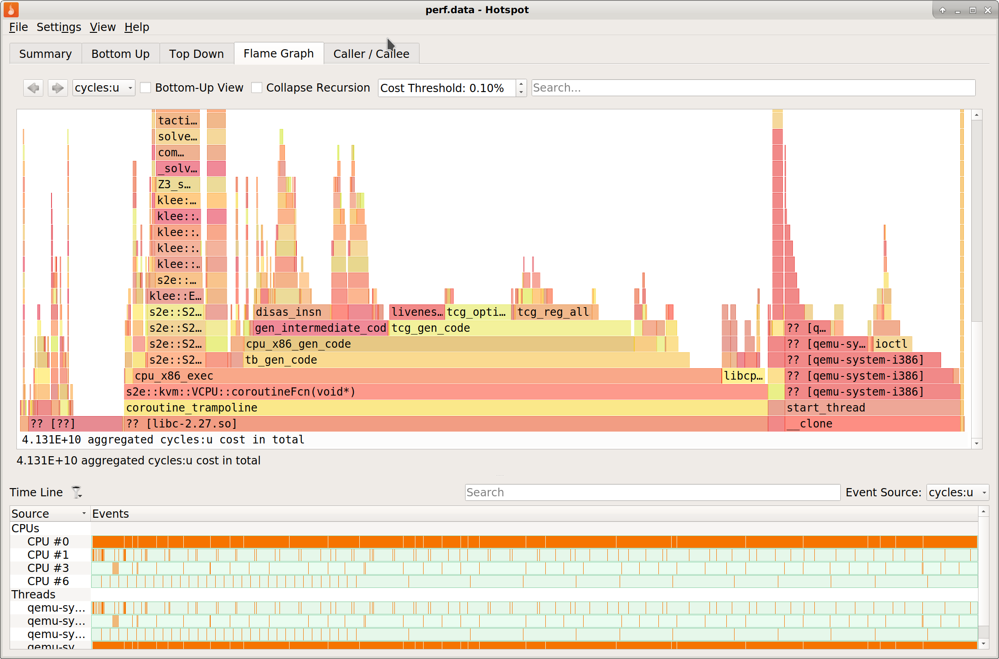

=============
Profiling S2E
=============

This page explains how to profile memory and CPU performance.

Profiling memory usage
======================

We are going to use `heaptrack <https://github.com/KDE/heaptrack>`_. Its main advantage over competing profilers
is that it is possible to inject it in a running S2E process. Others require using ``LD_PRELOAD``, which interferes
with ``libs2e.so`` and causes crashes. The disadvantage is that you cannot inject it before S2E starts.

1. Build ``heaptrack`` from source. Avoid using the one that ships with Ubuntu 18.04, it may not be as reliable.

2. Start S2E

3. Inject ``heaptrack`` into the running S2E instance:

    .. code-block:: bash

        $ ps aux | grep qemu
        ubuntu    31044 96.7  4.7 3487216 1191460 pts/8 Sl   13:54   0:03 /home/ubuntu/s2e/env/install/bin/qemu-system-i386 -drive file=/home/ubuntu/s2e/env/images/debian-12.5-i386/image.raw.s2e,format=s2e,cache=writeback -k en-us -nographic -monitor null -m 256M -enable-kvm -serial file:serial.txt -net none -net nic,model=e1000 -loadvm ready

        $ heaptrack -p 31044
        heaptrack output will be written to "/home/ubuntu/heaptrack/build/heaptrack.qemu-system-i38.31044.gz"
        injecting heaptrack into application via GDB, this might take some time...
        injection finished
        ...

4. Wait for S2E to terminate or kill it manually. You will see the following output:

    .. code-block:: bash

        heaptrack stats:
                allocations:            6836389
                leaked allocations:     46722
                temporary allocations:  1249045
        removing heaptrack injection via GDB, this might take some time...
        ptrace: No such process.
        No symbol table is loaded.  Use the "file" command.
        The program is not being run.
        Heaptrack finished! Now run the following to investigate the data:

          heaptrack --analyze "/home/ubuntu/heaptrack/build/heaptrack.qemu-system-i38.31044.gz"

5. Open the resulting file in the ``heaptrack`` GUI

   .. code-block:: bash

        $ heaptrack_gui "/home/ubuntu/heaptrack/build/heaptrack.qemu-system-i38.31044.gz"

.. image:: ./heaptrack.png

Profiling CPU performance
=========================

We are going to use `hotspot <https://github.com/KDAB/hotspot>`_. It is a convenient GUI wrapper around the Linux
`perf` tool.

1. Build ``hotspot`` from source

2. Start ``hotspot``

    .. code-block:: bash

        $ hotspot

.. image:: ./hotspot1.png

3. Start S2E

4. Start profiling

    - Click on ``Record Data``
    - Select ``Attach To Process(es)``
    - Select the S2E instance you want to profile
    - Click ``Start Recording``

5. Stop recording and view results

