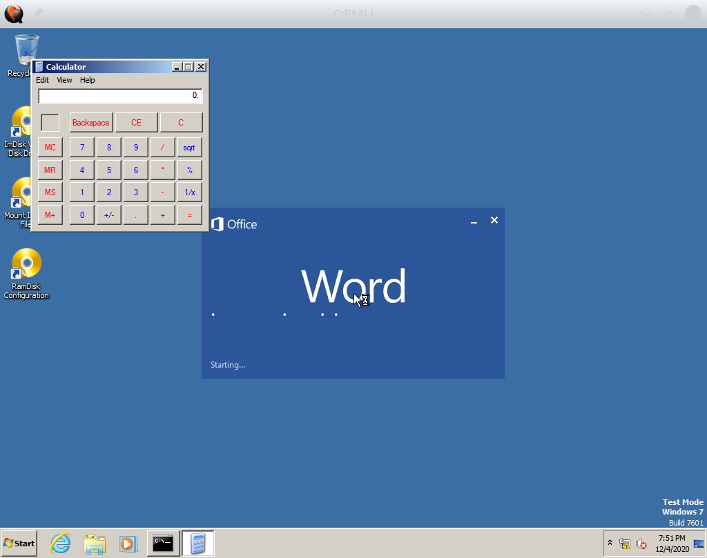
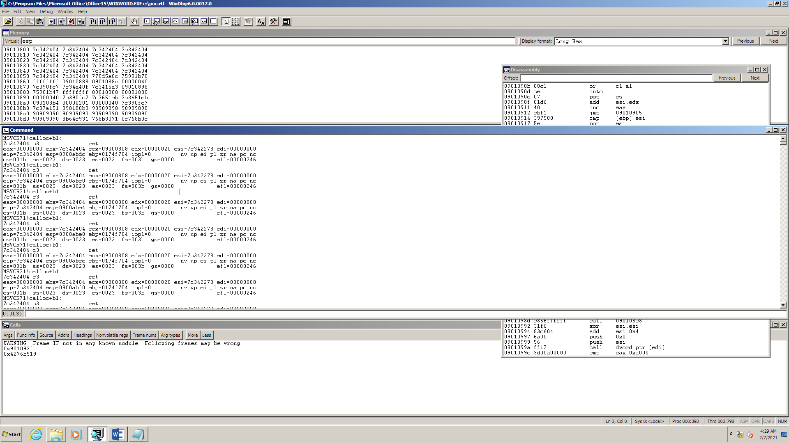
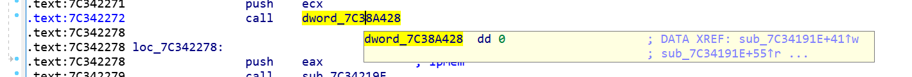
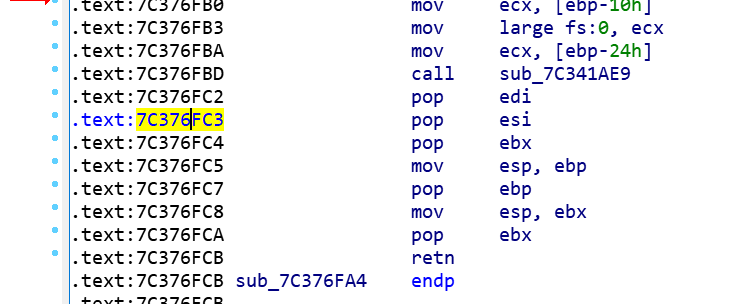

========================================
Control Flow Integrity Checking with S2E
========================================

Control flow integrity (CFI) violations occur when an attacker forces a program to execute unintended code. This often
happens as a result of a memory error, leading to an overwrite of code pointers with attacker-controlled data. There are
many classes of vulnerabilities that can lead to such overwrites. For example, a stack buffer overflow could allow an
attacker to take control of the return address of a function. Likewise, heap overflows could allow gaining control of
the target of an indirect function call. There exist many techniques to detect and mitigate CFI violations.
This `article <https://www.nebelwelt.net/publications/files/17CSUR.pdf>`_ gives an overview.

S2E implements a CFI checker plugin that detects CFI violations. In this tutorial, you will learn the following:

* How to use S2E to detect CFI violations in Microsoft Word.
* How to use the information about CFI violations that S2E provides in order to simplify malware analysis with WinDbg.
* The design and implementation of the CFI checker plugin as well as some of its limitations.

Setting up Microsoft Office
===========================

This tutorial assumes that you are familiar with S2E basics and that you have a working S2E environment.

Before starting, you must create a Windows 7 image with Microsoft Office 2013 installed. Don't worry, this is fully
automated. All you need is to provide an ISO file with Windows 7 and another ISO with Office. Once you have the images,
run the following command:

.. code-block:: bash

    (venv) s2e@ubuntu:~/s2e/env$ s2e image_build -g --iso-dir /path/to/iso/directory windows-7sp1pro-i386/office2013

If there are any errors, please refer to this `tutorial <../MSOffice/index.html>`__, which goes in much more
details on how to set up a Microsoft Office VM.

Running the CFI checker
=======================

After building a VM image, create a new analysis project with the following command:

.. code-block:: bash

    (venv) s2e@ubuntu:~/s2e/env$ s2e new_project -n cfi --tools=cfi --single-path \
        -i windows-7sp1pro-i386/office2013 \
        "./images/windows-7sp1pro-i386/office2013/guestfs/program files/microsoft office/office15/winword.exe" \
        ./source/s2e/testsuite/cfi-winword1-malicious/CVE-2015-1770-poc-calc.rtf

Here is a brief explanation of each parameter:

* ``-n cfi``: this is the name of the project. You may choose any name you like.

* ``--tools=cfi``: this enables the CFI checker tool. It monitors execution for CFI violations.

* ``--single-path``: we will not need symbolic execution in this tutorial, so we use S2E in concrete single-path mode
  as a simple instrumentation platform. This mode is considerably faster as it does not need to keep track of
  different execution paths or symbolic data.

* ``-i windows-7sp1pro-i386/office2013``: this is the Microsoft Office image we want to use. Note that this particular
  exploit is sensitive to the Office version and you must use Office 2013 on Windows 7 32-bit for this to work
  reliably.

* ``/path/to/winword.exe /path/to/document.rtf``: these are the paths to the program we want to analyze and
  the path to the document that needs to be opened. Note that these paths are on the host. ``s2e-env`` automatically
  detects that the program refers to a binary that is located in the guest image and that the argument is a path to a
  host file. It then automatically translates these two paths into something that the Windows guest can handle.

Now that the project is created, run it as follows:

.. code-block:: console

    (venv) s2e@ubuntu:~/s2e/env$ cd projects/cfi

    (venv) s2e@ubuntu:~/.../cfi$ GUI=1 ./launch-s2e.sh

You will see a QEMU window popping up, then Word will load, and after 5-10 minutes, you should see that Word opens the
calculator:

At this point, you can terminate S2E by closing the QEMU window. Behind the scenes, S2E recorded an execution trace
that contains information about control flow integrity violations. We will analyze this next.

Analyzing a malicious document
==============================

In this part of the tutorial, we will learn how to extract the location of CFI violations that the CFI checker plugin
detected, then we will show how to use this information to analyze the malicious document in a debugger.

Locating CFI violations
-----------------------

One important step in analyzing a malicious document is to find out the code address of the program where execution is
subverted to an attacker-controlled program counter.

The CFI checker records in an execution trace all the addresses that transfer execution to unwanted locations. In order
to view these code locations, run the following commands:

.. code-block:: bash

    # Dump the execution trace in JSON format of the latest run of the cfi project
    (venv) s2e@ubuntu:~/s2e/env$ s2e execution_trace cfi

    # View the execution trace
    (venv) s2e@ubuntu:~/s2e/env$ jq . projects/cfi/s2e-last/execution_trace.json | less

You will see various events recorded during execution, most of which is information about what processes and modules
are loaded or unloaded. We are interested in trace items of the types ``CALL_VIOLATION`` or
``RETURN_VIOLATION``. Look for the ``VIOLATION`` string. The first item you should find is a call violation:

.. code-block:: json

    {
      "state_id": 0,
      "timestamp": 599746780101,
      "address_space": 1424875520,
      "pid": 1936,
      "tid": 1224,
      "pc": 2084007875,
      "type": "CALL_VIOLATION",
      "source": {
        "pc": 2083791474,
        "module_path": "/Program Files/Microsoft Office/Office15/ADDINS/MSVCR71.DLL",
        "module_pc": 2083791474
      },
      "destination": {
        "pc": 2084007875,
        "module_path": "/Program Files/Microsoft Office/Office15/ADDINS/MSVCR71.DLL",
        "module_pc": 2084007875
      },
      "module": {
        "name": "/Program Files/Microsoft Office/Office15/ADDINS/MSVCR71.DLL",
        "pc": 2084007875
      }
  }

Here is a brief explanation of the various fields in the trace entry. You will find more details
about execution traces `here <../../Plugins/Tracers/ExecutionTracer.rst>`__.

First, there are generic trace item fields that you will find in all trace entries. They are not important for this
tutorial.

* ``state_id``: we do not use symbolic execution here, so we only have one state with id 0.
* ``timestamp``: time in microseconds elapsed since the epoch.
* ``address_space``: the value of the CR3 register that holds the page directory address.
* ``pid``, ``tid``: the process and thread id where the violation occurred.
* ``pc``: the program counter at the moment the trace item was recorded. For a call violation, this address
  points to the target of the call.
* ``module``: contains the path and the module-relative program counter that correspond to the ``pc`` field above.

Then, there are fields that are specific to call violations. We use them to locate the CFI violations.

* ``source``: this contains the information about the program counter that caused the CFI violation.
  In this case, the source is the call instruction at address ``0x7C342272`` in ``msvcr71.dll``.
  You can open this DLL in your favorite disassembler and enter the given address to inspect the call instruction.

* ``destination``: this is the invalid address where execution went. The CFI checker reports a violation in case
  a call instruction goes to an address that is not the start of a valid function in the program's address space.
  In this case, the destination is ``0x7C376FC3`` in ``msvcr71.dll``.

We now have all the information we need to analyze the exploit further. In the next section, we will run Word in a
debugger, where we set a breakpoint at address ``0x7C342272``, then single-step the execution in order to understand how
the exploit works.

Setting up WinDbg for analysis
------------------------------

To ensure reproducibility, we will set up a VM that contains the exact copy of the software used during CFI analysis in
S2E. In order to do this, perform the following steps:

.. code-block:: bash

    # Go to the directory that contains the VM image that we used during analysis.
    # It is important to use the same image as during CFI checking, otherwise there
    # is no guarantee that the exploit will work. The exploit is sensitive to the
    # environment and may just crash Word if the vulnerable binaries change.
    $ cd ~/s2e/env/images/windows-7sp1pro-i386/office2013

    # Copy the S2E image into a new one that you can then freely modify and run in
    # vanilla QEMU. It is highly recommended to do this on a copy-on-write file system
    # to minimize disk space usage. Do NOT modify the original S2E image, you will
    # not be able to use it in S2E anymore and will have to rebuild it from scratch.
    $ cp --reflink=always image.raw.s2e image.raw

    # Copy the malicious document sample into the guest VM
    $ virt-copy-in -a image.raw \
 ~/s2e/env/source/s2e/testsuite/cfi-winword1-malicious/CVE-2015-1770-poc-calc.rtf /

    # Use your system's QEMU to run the VM. You do not need S2E anymore at this point,
    # so any hypervisor should work. Make sure to disable networking. The sample exploit
    # should not be weaponized, but you never know.
    $ qemu-system-i386 --enable-kvm -m 4G image.raw -net none

Wait for the guest to boot, then perform the following steps:

1. Copy ``c:\CVE-2015-1770-poc-calc.rtf`` to ``c:\poc.rtf``. This exploit overwrites the original file to avoid
   leaving traces. It is therefore important to have a backup copy in case you would like to run it multiple times.

2. Open WinDbg, then go to ``File/Open Executable``, select the path to Word, and specify ``c:\poc.rtf``
   as argument. S2E images come with WinDbg pre-installed, you will find it in the start menu.

3. Run Word for a few seconds until ``msvcr71.dll`` is loaded, then break the execution.

4. Add a code breakpoint at the program counter of the first call violation. In this example, it is ``0x77342272``.
   This must be done after ``msvcr71.dll`` is loaded since this address falls inside that library.
   Note that in this case, there is no ASLR, so the address should be deterministic. For more advanced exploits, you
   may need to specify the address relative to the module, which you can get from the execution trace as well.

5. Resume execution. If all goes well, execution should stop at the specified breakpoint. If the breakpoint is not
   triggered, make sure you did not wait too long in step 3.

6. Single-step the execution and observe what happens. In the next section, we will look in more details at what
   the exploit is doing.

Tracing the exploit
-------------------

This part of the tutorial focuses on understanding what the exploit does after it successfully subverts the control
flow of the application. We will not go into the details of the vulnerability that made this subversion
possible in the first place. In other words, we will not look at what happened *before* the CFI violation, but at what
happened *after*.

The screenshot below shows the indirect call instruction where the first CFI violation occurred:

Normally, a call instruction invokes a function. However, in this case, execution goes a code fragment that does not
look like the start of a function. The attacker managed to modify the location that stores the call target to subvert
the execution to the desired code:

Before continuing, here is a brief recap of how function calls work on x86. The CPU has a stack pointer register that
stores the current location of the top of the stack. A call instruction pushes the address of the next instruction on
the stack before setting the program counter to the first instruction of the target function. When the function wants to
return to the caller, it executes a return instruction that pops the address at the current stack location. Both
instructions update the stack pointer register.

Notice how the code fragment above overwrites the stack pointer register. The attacker subverts the stack pointer in
order to force return instructions to go to arbitrary code locations. The attacker would typically choose the location
of a small code fragment (called a `gadget`) that ends with a return instruction. When the gadget's execution is
completed, its return instruction will go to the second gadget, whose return instruction will go to the third one, etc.
until the chain of gadgets accomplishes a desired task. This is called `return-oriented programming`, or `ROP`.

The attacker-controlled stack contains a long sequence of return addresses - a `ROP chain` -
that leads the process to call the ``VirtualProtect`` function in order to make the injected shell code executable.
Once this is done, the chain passes control to the first stage of the payload. The first stage loads and decrypts the
second stage, which will then load the third stage, in this case the embedded calculator binary.

In summary, we have seen how to use S2E to quickly determine the start of the ROP chain and how to use this
to make it easier to analyze the exploit in WinDbg.

Design and implementation
=========================

The CFI checker plugin (``CFIChecker.cpp``) verifies the target of both return and indirect call instructions. It checks
that the target of a return instruction matches the return address saved by the corresponding call instruction using a
shadow stack. For indirect calls, it verifies that the target is a valid function entry point and not, e.g., the middle
of a function.

The CFI checker makes extensive use of the S2E instrumentation API and plugin infrastructure. It efficiently
instruments call and return instructions in the process of interest by relying on the ``ProcessExecutionDetector``
plugin. It uses the ``WindowsMonitor`` plugin to keep track of processes, threads, modules, and stacks. It leverages the
``AddressTracker`` plugin to track valid call targets. Finally, ``ExecutionTracer`` and ``UserSpaceTracer`` plugins
enable the recording of execution traces for offline analysis using the ``s2e execution_trace`` tool that we saw earlier
in this tutorial.

Limitations
===========

Implementing a robust CFI checker that works on large closed-source applications such as Microsoft Office comes with a
number of challenges. In theory, all the CFI checker needs to do is record return addresses on a separate shadow stack,
then match the return address taken from the program stack with the one on the shadow stack. In practice, there are
several problems that lead to both false positives and false negatives.

The main problem are false positives. Programs often contain legitimate code that performs various tricks
that make the shadow stack go out of sync with the actual stack. For example, exception handlers will unwind the stack
and call or return to unusual places. Non-standard function prologs, such as those in ``__EH_epilog3`` or
``__SEH_epilog4`` will render function signature matching ineffective, causing FPs for indirect calls. Finally, JITed
code is another major source of FPs in practice.

The CFI checker deals with false positives by whitelisting problematic code patterns. If a return instruction triggers a
violation, the checker reads the instructions that come right before the return. If these instructions match one of the
whitelisted code patterns, the plugin ignores the CFI violation. If the return instruction comes from or goes to an
unknown code region, the violation is likewise ignored. Finally, the few functions that come with non-standard prologs
are whitelisted too. Note that this does not work for 64-bit calling conventions since they do not have a common prolog
pattern. An alternative would be to use tools like IDA to extract function addresses more accurately.

This whitelisting approach, while simple, may lead to false negatives. For example, it is theoretically possible for
an exploit to use gadgets that are whitelisted code patterns in order to evade detection. Likewise, the set of call
targets is overapproximated. A malicious payload could invoke a function, but not one that is intended to be called
at the particular call site. Solving this requires further program analysis in order to be accurate.

Finally, the CFI checker plugin does not support indirect jumps. An exploit that uses jump-oriented programming instead
of return-oriented programming will go undetected.

Conclusion
==========

In this tutorial, we learnt how to use S2E to detect control flow integrity violation in Microsoft Office. Here are
a few pointers for what to explore next:

* Turn S2E into a powerful malware analysis engine. A CFI violation is pretty much always an indication that
  something fishy is going on. Use this observation to detect any kind of malicious documents without having to use
  easily bypassable virus signatures and other heuristics.

* Improve the ``CFIChecker`` plugin to support Linux applications, kernel code, better 64-bit support, proper
  handling of user-space C++ exceptions, fewer FPs and FNs, more big applications (Adobe Reader...).
