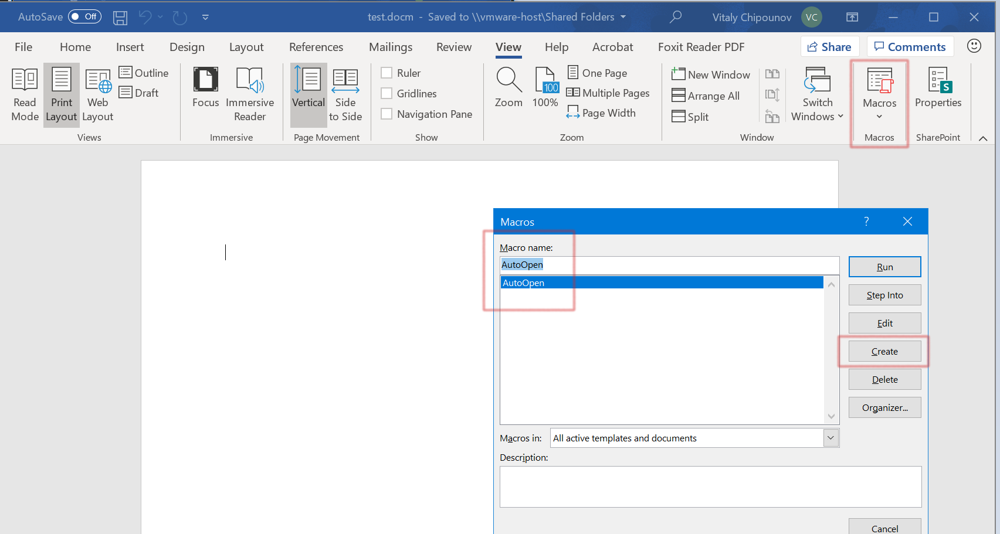
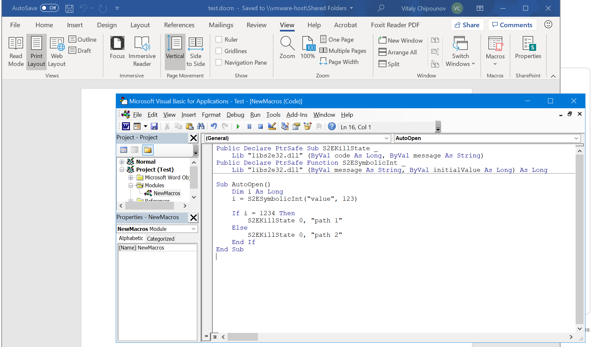
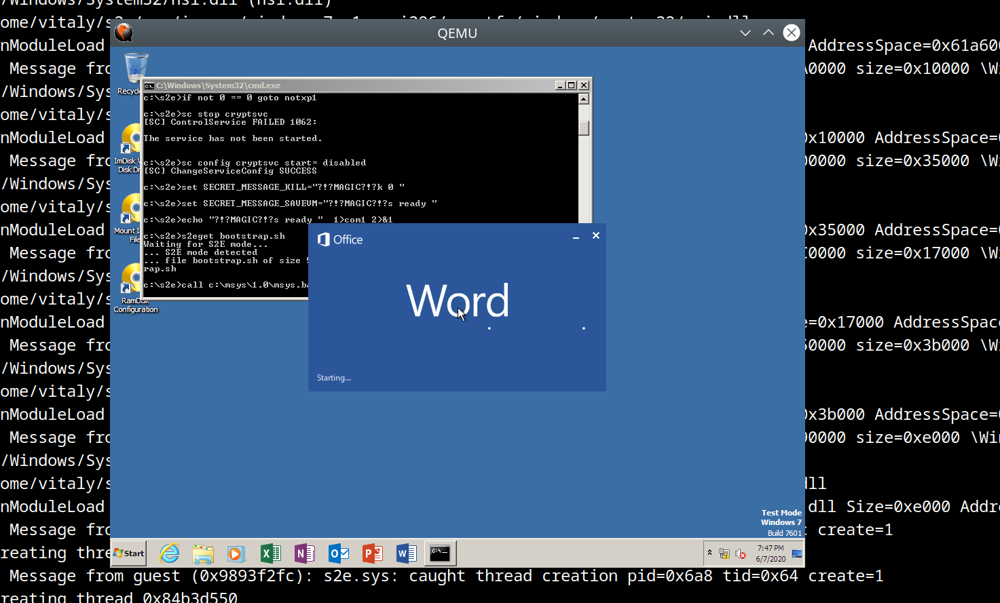

====================================
Analyzing Microsoft Office Documents
====================================

In this tutorial, we will show how to symbolically execute a VBA macro embedded in an Office document.

We assume that you already have a working S2E environment. If not, please follow the
`setup instructions <../../s2e-env.rst>`__ first.

Building a Microsoft Office image
=================================

In order to analyze anything in S2E, you first need to build a guest VM image that contains the required software, in
this case Windows and Microsoft Office. S2E supports various combinations of Windows and Office versions (Windows XP, 7,
10 with Office 2010, 2013, 2016, and 2019). Run the following command to get a list of supported combinations:

.. code-block:: console

    (venv) s2e@ubuntu:~/s2e/env$ s2e image_build
    Available image groups:
     * linux      - Build linux images
     * windows    - Build windows images
     * office     - Build office images
     * office2019 - Build office2019 images
     * office2016 - Build office2016 images
     * office2013 - Build office2013 images
     * office2010 - Build office2010 images
     * all        - Build all images

    Available images:
     * debian-12.5-i386                    - Debian i386 image
     * debian-12.5-x86_64                  - Debian x86_64 image
     * windows-10pro1909-x86_64            - Windows 10 Pro 1909 x86_64
     * windows-10pro1909-x86_64/office2010 - Microsoft Office 2010 32-bit
     * windows-10pro1909-x86_64/office2013 - Microsoft Office 2013 32-bit
     * windows-10pro1909-x86_64/office2016 - Microsoft Office 2016 32-bit
     * windows-10pro1909-x86_64/office2019 - Microsoft Office 2019 32-bit
     * windows-7sp1ent-x86_64              - Windows 7 Enterprise SP1 x86_64
     * windows-7sp1ent-x86_64/office2010   - Microsoft Office 2010 32-bit
     * windows-7sp1ent-x86_64/office2013   - Microsoft Office 2013 32-bit
     * windows-7sp1ent-x86_64/office2016   - Microsoft Office 2016 32-bit
     * windows-7sp1pro-i386                - Windows 7 Professional SP1 i386
     * windows-7sp1pro-i386/office2010     - Microsoft Office 2010 32-bit
     * windows-7sp1pro-i386/office2013     - Microsoft Office 2013 32-bit
     * windows-7sp1pro-i386/office2016     - Microsoft Office 2016 32-bit
     * windows-xpsp3pro-i386               - Windows XP Professional SP3 i386
     * windows-xpsp3pro-i386/office2010    - Microsoft Office 2010 32-bit

You can use ``s2e image_build`` to build one or more images by either specifying the image names individually or using
an image group. For example, in order to build Office 2016 on all supported OSes, use ``s2e image_build office2016``.
For the purpose of this tutorial, let us build Office 2016 on 32-bit Windows 7 SP1.

Before starting the build, you must first download the required Windows and Office installation disks (ISOs). You can
get them from MSDN. Look for these two files and download them:

1. ``en_windows_7_professional_with_sp1_x86_dvd_u_677056.iso``. This contains Windows 7 SP1 32-bit.
2. ``en_office_professional_plus_2016_x86_x64_dvd_6962141.iso``. This contains Office 2016 in 32 and 64-bit versions.
   Installation scripts will select the 32-bit version of Office.

Once you have the required ISOs, run the following command:

.. code-block:: console

    (venv) s2e@ubuntu:~/s2e/env$ s2e image_build -g --iso-dir /path/to/iso/directory windows-7sp1pro-i386/office2016

This will take 30-60 minutes and use about 50GB of disk space. The ``-g`` flag enables graphics output so that you can
see the progress. The installation is fully automated, you will not be asked to do anything.

Do not worry if you do not have MSDN or cannot find the files above. You can replace ``office2016`` in the command line
above with the version that you have. The image installation script will tell you which ISO name you need if
it cannot find one inside ``--iso-dir``. If you have a physical installation disk, create an ISO image out if it, and
use that image. Please follow the readme in the `guest-images <https://github.com/s2e/guest-images>`__ repository in
order to understand how to customize the installation.

.. note::

  * Some versions of Office and Windows require a product key in order to run. Please update
    ``apps.json`` and ``images.json`` in the ``guest-images`` repository as appropriate. ``s2e image_build`` will tell you
    if you need a product key.
  * It is strongly recommended to use a file system that supports copy-on-write (XFS, BTRFS) in order to minimize the amount
    of disk space used by guest images. The build script will explain how to set one up if needed.
  * The installation scripts verify that the Office installation disk is correct, so you should get an error message
    in case you used the wrong one.

2. Creating a test document
===========================

In this step, we will create a Microsoft Word document containing a macro that runs automatically when the document is
opened. You will need another Windows / Office installation to do that. You have two options:

a. Use a separate installation, e.g., the one you normally use for work. It does not have to be the same version
   of Office as the one you built previously.
b. Reuse the image that you built in the previous step.
   For that, copy the ``./images/windows-7sp1pro-i386/office2016/image.raw.s2e`` file and run it in your usual
   QEMU/VirtualBox/VMware. The image is in raw format and you may need to convert it to VMDK or to whatever
   format your hypervisor requires.

Once you have your Office installation ready, proceed as follows:

a. Open Word
b. Create a new document
c. Open the macros window
d. Call the macro ``AutoOpen``, then click ``Create``. It is important to name the macro ``AutoOpen``, so that Word executes
   it automatically when it opens the document. Note that ``s2e image_build`` configures Office applications
   so that they open macros automatically without prompting the user, which is more convenient for automated testing.

Then, in the script editor, type the following code:

.. code-block:: vbscript

    Public Declare PtrSafe Sub S2EKillState _
      Lib "libs2e32.dll" (ByVal code As Long, ByVal message As String)
    Public Declare PtrSafe Function S2ESymbolicInt _
      Lib "libs2e32.dll" (ByVal message As String, ByVal initialValue As Long) As Long

    Sub AutoOpen()
        Dim i As Long
        i = S2ESymbolicInt("value", 123)

        If i = 1234 Then
            S2EKillState 0, "path 1"
        Else
            S2EKillState 0, "path 2"
        End If
    End Sub

When you are done, click ``run`` to try it. If everything is OK, you should get an error message saying that
``libs2e32.dll`` was not found. This is fine, this DLL will be available inside the S2E environment.
Finally, save the document as ``test.docm`` and copy it to your Linux machine where S2E is installed.

When ran in S2E, this code will fork two states, one where ``value == 1234`` and another where ``value != 1234``. These
two states will terminate with a message ``path 1`` and ``path 2``. To do this, the macro first imports two functions
from ``libs2e32.dll``: one that returns a symbolic integer and another one that terminates the path that executes it.

Note that it is important to explicitly kill execution paths, otherwise they will run forever and S2E will never
terminate. This is because Word is an event-driven GUI program. Unlike a command line tool, it does not
terminate unless it is closed by the user (or a script). To make things simpler (and faster), we terminate
the paths directly from the VBA script. Alternatively, you could modify the VBA script to exit Word, in which case the
path would be terminated by the script that launched Word (i.e., ``bootstrap.bat`` that you will find in the project
directory).

3. Creating an analysis project
===============================

Before we can run the document in S2E, we need to create a new analysis project. A project contains all the required
S2E configuration to run the desired application. Run the following command:

.. code-block:: console

    (venv) s2e@ubuntu:~/s2e/env$ s2e new_project -n winword -i windows-7sp1pro-i386/office2016 \
       ./images/windows-7sp1pro-i386/office2016/guestfs/program\ files/microsoft\ office/root/office16/winword.exe /path/to/test.docm

This command creates a project called ``winword`` based on the ``windows-7sp1pro-i386/office2016`` guest image.
It also tells S2E to start ``winword.exe`` with ``test.docm`` as argument. Pay attention to how the paths are specified:

* **Path to the binary.** If you need to analyze a binary that is already
  present on the guest image, you can reference it using a path of the form ``./images/os/app/guestfs/...``.
  Image installation scripts mirrored the binaries contained in the guest VM image onto the host file system,
  so that the project creation tool and S2E plugins can easily access them.
  The project creation tool detects these kinds of paths and automatically translates them to something reasonable for the guest,
  in this case ``c:\program files\microsoft office\root\office16\winword.exe``.

* **Path to the document.** The project creation tool scans every argument passed to the application and when it detects
  an argument that looks like a path to a file on the host, it automatically uploads that file to the guest and
  adapts the invocation accordingly. In this particular case, the guest will run the following command:
  ``c:\program files\microsoft office\root\office16\winword.exe x:\test.docm``.

Let us have a quick look at the files created for the project:

.. code-block:: console

  (venv) s2e@ubuntu:~/s2e/env/projects/winword$ ls -la
  total 68
  drwxrwxr-x  2 s2e s2e   239 Jun  9 00:24 .
  drwxrwxr-x 52 s2e s2e 12288 Jun  8 23:26 ..
  lrwxrwxrwx  1 s2e s2e    38 Jun  5 20:16 test.docm -> /home/ubuntu/Documents/test.docm
  -rw-rw-r--  1 s2e s2e    62 Jun  5 20:16 test.docm.symranges
  -rw-rw-r--  1 s2e s2e  5244 Jun  7 17:25 bootstrap.sh
  lrwxrwxrwx  1 s2e s2e    68 Jun  5 20:16 guestfs0 -> /home/ubuntu/s2e/env/images/windows-7sp1pro-i386/office2016/guestfs
  lrwxrwxrwx  1 s2e s2e    57 Jun  5 20:16 guestfs1 -> /home/ubuntu/s2e/env/images/windows-7sp1pro-i386/guestfs
  lrwxrwxrwx  1 s2e s2e    46 Jun  5 20:16 guest-tools32 -> /home/ubuntu/s2e/env/install/bin/guest-tools32
  -rwxrw-r--  1 s2e s2e  3181 Jun  5 20:16 launch-s2e.sh
  -rw-rw-r--  1 s2e s2e  2899 Jun  5 20:16 library.lua
  -rw-rw-r--  1 s2e s2e  1322 Jun  5 20:16 models.lua
  -rw-rw-r--  1 s2e s2e  1337 Jun  5 20:16 project.json
  -rw-rw-r--  1 s2e s2e 13921 Jun  5 20:16 s2e-config.lua

* ``test.docm``: this is a symbolic link to ``test.docm``, which is the document we want to open. It will be uploaded
  into the guest VM when starting the analysis. You can modify this document and rerun the analysis without
  having to re-create a new project every time.
* ``test.docm.symranges``: this file specifies which part of the ``test.docm`` file should be made symbolic.
  Since we do not need to make the content of ``test.docm`` symbolic, there is no need to modify
  ``test.docm.symranges``.
* ``bootstrap.sh``: when S2E starts, it uploads and executes this script in the guest. ``bootstrap.sh`` will download
  ``test.docm`` from the host, make the file symbolic according to ``test.docm.symranges``, then invoke Word.
* ``s2e-config.lua``: this is the S2E configuration file. You can use it to configure various S2E analysis plugins.
  You do not need to modify it for this tutorial.
* There are some more files and symbolic links that are not important for this tutorial. You can find more details
  about them `here <../../s2e-env.rst>`__.

4. Running the project
======================

Run S2E as follows:

.. code-block:: console

  (venv) s2e@ubuntu:~/s2e/env/projects/winword$ ./launch-s2e.sh

The command should terminate after a minute or two. You will see many messages on the screen. These are mostly debug
logs showing which modules Windows is loading, what processes / threads it creates, etc.

In case you also want to see the graphics output, comment out ``GRAPHICS=-nographic`` in ``launch-s2e.sh``. You should
then see something like in the screenshot below:

The console will show the following output (also recorded in ``s2e-last/debug.txt``):

.. code-block:: console

  45 [State 0] BaseInstructions: Inserted symbolic data @0x1283ec of size 0x4: value='\x7b\x00\x00\x00' pc=0x7d81ce8
  45 [State 0] Forking state 0 at pc = 0x7818743 at pagedir = 0xcf50000
      state 0
      state 1
  45 [State 0] BaseInstructions: Killing state 0
  45 [State 0] Terminating state: State was terminated by opcode
              message: "path 2"
              status: 0x0
  45 [State 0] TestCaseGenerator: generating test case at address 0x7d81dc8
  45 [State 0] TestCaseGenerator:           v0_value_0 = {0x7b, 0x0, 0x0, 0x0}; (int32_t) 123, (string) "{..."
  45 [State 0] Switching from state 0 to state 1
  45 [State 1] BaseInstructions: Killing state 1
  45 [State 1] Terminating state: State was terminated by opcode
              message: "path 1"
              status: 0x0
  45 [State 1] TestCaseGenerator: generating test case at address 0x7d81dc8
  45 [State 1] TestCaseGenerator:           v0_value_0 = {0xd2, 0x4, 0x0, 0x0}; (int32_t) 1234, (string) "...."
  All states were terminated

As expected, the VBA macro forked two paths, one in which the value is equal to 1234.

5. Exercises
============

1. Remove the call to ``S2EKillState`` from the macro and rerun the analysis. What do you observe? Does S2E terminate?
   Why, why not?

2. Have a look at various functions in ``libs2e32.dll`` and try to call them from the macro. For example, try to create
   a symbolic byte using ``S2ESymbolicChar`` or print a message with ``S2EMessageFmt``.
   The source for ``libs2e32.dll`` is located `here <https://github.com/S2E/s2e/tree/master/guest/windows/libs2e>`__.

3. Create an Excel document with a macro and the corresponding project, then run it and check the results.

4. Modify ``s2e-config.lua`` to record code `coverage <../../Howtos/Coverage/index.rst>`__ for various DLLs, e.g.,
   for ``vbe7.dll``, then visualize it in IDA.

6. Conclusion
=============

This tutorial presented the basics of running VBA macros in S2E. Here are some pointers about more advanced uses
and things you may want to try next:

**Trigger-based malware analysis.** A malicious macro would typically execute itself if some condition is met, e.g.,
only execute on a specific day of the week, or if the computer has a particular name. Detonating such macros would
require making symbolic the results of the system calls that it invokes rather than using ``S2ESymbolicInt`` as shown
in this tutorial. You can `instrument <https://adrianherrera.github.io/post/malware-s2e>`__ syscalls using EasyHook or
any other hooking framework of your choice.

**Code coverage analysis.** S2E is currently not well suited to analyze code coverage of higher level languages. For
example, you will not be able to easily get the actual line of code that forked using ``s2e forkprofile``. Instead, you
will get the location in the interpreter's library (e.g., ``vbe7.dll``). Implementing techniques such as `Chef
<http://www.stefanbucur.net/assets/pubs/chef.pdf>`__ may alleviate this problem.

.. code-block:: console

  (venv) s2e@ubuntu:~/s2e/env$ s2e forkprofile winword
  # The fork profile shows all the program counters where execution forked:
  # process_pid module_path:address fork_count source_file:line_number (function_name)
  01704 /Program Files/Common Files/Microsoft Shared/VBA/VBA7/VBE7.DLL:0x65008743    1 (no debug info)
