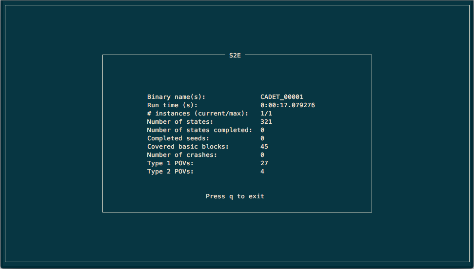
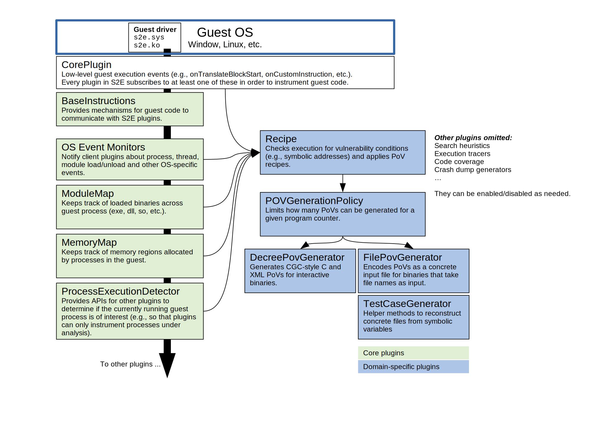

===============================================================
Using S2E to generate PoVs for Linux, Windows, and CGC binaries
===============================================================

In this tutorial, you will learn:

* How to configure S2E in order to automatically generated proofs of vulnerability (PoVs) for Linux,
  Windows, and Decree binaries.
* How S2E implements PoV generation, so that you can extend it for your own needs. We will show an overview
  of the S2E plugin architecture as well as the plugins involved in PoV generation.

.. note::

    Before starting this tutorial, make sure that...
        * you understand the `theory <pov.rst>`__ behind automated PoV generation
        * you have a working S2E environment ready (e.g, in the ``~/s2e/env/`` directory)

Quickstart on Windows and Linux
===============================

S2E comes with a ``vulnerabilities`` demo which demonstrates several types of vulnerabilities that S2E can detect.
You can find the corresponding source file in
`vulnerabilities.c <https://github.com/S2E/s2e/blob/master/guest/common/demos/vulnerabilities.c>`__.

1. Build the guest tools. We will use the 32-bit Linux version here.
   You may also use the 64-bit version and/or the Windows version (in ``guest-tools{32|64}-win``).

.. code-block:: console

    $ cd ~/s2e/env/build/s2e/guest-tools32
    $ make

2. Create an analysis project

.. code-block:: console

    $ cd ~/s2e/env
    $ s2e new_project -i debian-9.2.1-i386 -n vuln-lin32-32 --enable-pov-generation \
      build/s2e/guest-tools32/common/demos/vulnerabilities @@

Here is a breakdown of the ``s2e new_project`` command above:

* It creates a new project called ``vuln-lin32-32`` that will run on the ``debian-9.2.1-i386`` image.

* The ``--enable-pov-generation`` is important in order to generate PoVs. If you omit it, you will just get random test
  cases, which will at best crash the binary depending on what the constraint solver generates. Vulnerability generation
  involves a number of additional plugins that may add overhead to the analysis, so they are disabled by default unless
  you actually need them.

* Finally, the ``@@`` marker tells that the binary takes as input a file. This marker will be replaced at runtime with
  an actual file containing symbolic data.

.. note::

    You should build the desired guest image first, or use the ``-d`` flag if you want to download a pre-built image
    instead. Only Linux-based images are available for download. You must build Windows images yourself.

3. Launch S2E and wait until the analysis completes (it should take less than 30 seconds).

.. code-block:: console

    $ cd ~/s2e/env/projects/vuln-lin32-32
    $ ./launch-s2e.sh

Look at the files inside ``~/s2e/env/projects/vuln-lin32-32/s2e-last``. This folder contains all the analysis results.
You should have files that look like this:

.. code-block:: console

    $ ls ~/s2e/env/projects/vuln-lin32-32/s2e-last
    _tmp_input-crash@0x0-pov-unknown-0
    _tmp_input-crash@0x0-pov-unknown-3
    _tmp_input-recipe-type1_i386_generic_reg_ebp.rcp@0x8048760-pov-type1-0
    _tmp_input-recipe-type1_i386_generic_reg_edi.rcp@0x8048760-pov-type1-0
    _tmp_input-recipe-type1_i386_generic_shellcode_eax.rcp@0x804883e-pov-type1-3
    ...

These are concrete input files that demonstrate the vulnerability. Pick one of them and run it on the binary on your
host machine under GDB, as follows.

4. Confirm that the PoVs exercise the vulnerabilities

.. code-block:: console

    $ gdb --args ./vulnerabilities s2e-last/_tmp_input-recipe-type1_i386_generic_shellcode_eax.rcp@0x804883e-pov-type1-3
    (gdb) r

The program should crash at program counter ``0x44556677`` and contain ``0xccddeeff`` in the ``eax`` register.

.. code-block:: console

    Starting program: /home/user/s2e/env/projects/vuln-lin32-32/vulnerabilities
         s2e-last/_tmp_input-recipe-type1_i386_generic_shellcode_eax.rcp@0x804883e-pov-type1-3

    Demoing function pointer overwrite

    Program received signal SIGSEGV, Segmentation fault.
    0x44556677 in ?? ()
    (gdb) info registers
    eax            0xccddeeff       -857870593
    ecx            0x44556677       1146447479
    edx            0x40     64
    ebx            0x0      0
    esp            0xffffcd1c       0xffffcd1c
    ebp            0xffffcd68       0xffffcd68
    esi            0x804b008        134524936
    edi            0xf7fa2000       -134602752
    eip            0x44556677       0x44556677
    eflags         0x10246  [ PF ZF IF RF ]
    cs             0x23     35
    ss             0x2b     43
    ds             0x2b     43
    es             0x2b     43
    fs             0x0      0
    gs             0x63     99

That's it. What you have here is an input file that proves that an attacker has full control of the program counter as
well as an additional general purpose register.

Understanding recipes
=====================

So where do the magic values ``0x44556677`` and ``0xccddeeff`` come from? Short answer: from the ``FilePovGenerator``
plugin configuration. Open ``s2e-config.lua`` and look for the following section:

.. code-block:: lua

    -------------------------------------------------------------------------------
    -- This plugin writes PoVs as input files. This is suitable for programs that
    -- take their inputs from files (instead of stdin or other methods).
    add_plugin("FilePovGenerator")
    pluginsConfig.FilePovGenerator = {
        -- The generated PoV will set the program counter
        -- of the vulnerable program to this value
        target_pc = 0x0011223344556677,

        -- The generated PoV will set a general purpose register
        -- of the vulnerable program to this value.
        target_gp = 0x8899aabbccddeeff
    }

You can specify in the configuration file which register values to set for the concrete test case.
The configuration accepts 64-bit values, which the PoV generator will truncate if the program is 32-bit.

Now, in order to understand why these values get written into the program counter and the ``eax`` register, we need to
look at recipes. If you look closer, you will notice that the test case file name above contains
``type1_i386_generic_shellcode_eax``. This means that this test case was derived from the
``type1_i386_generic_shellcode_eax.rcp`` recipe. You can find the recipes in the `recipes` folder in your project
directory. The recipe used here has the following contents:

.. code-block:: console
    :caption: type1_i386_generic_shellcode_eax.rcp

    # Set GP and EIP with shellcode
    # mov eax, $gp
    # mov ecx, $pc
    # jmp ecx
    :reg_mask=0xffffffff
    :pc_mask=0xffffffff
    :type=1
    :arch=i386
    :platform=generic
    :gp=EAX
    :exec_mem=EIP
    [EIP+0] == 0xb8
    [EIP+1] == $gp[0]
    [EIP+2] == $gp[1]
    [EIP+3] == $gp[2]
    [EIP+4] == $gp[3]
    [EIP+5] == 0xb9
    [EIP+6] == $pc[0]
    [EIP+7] == $pc[1]
    [EIP+8] == $pc[2]
    [EIP+9] == $pc[3]
    [EIP+10] == 0xff
    [EIP+11] == 0xe

Here is what every line of this recipe means:

* ``reg_mask`` and ``pc_mask`` indicate which bits of the general purpose register and program counter can be
  controlled by the attacker. It will be ``0xffffffff`` in almost all cases, meaning that all bits can be controlled.

* ``type`` can be either 1 or 2 (see DARPA's CGC `terminology
  <https://github.com/CyberGrandChallenge/cgc-release-documentation/blob/master/walk-throughs/understanding-cfe-povs.md>`__).
  Type 1 recipes control register values. Type 2 allow memory exfiltration.

* ``arch`` and ``platform`` define when the recipe is applicable. In this case, we have a recipe that works on 32-bit
  programs and all OSes (Windows, Linux, etc...). If you have OS-specific shellcode, you must set the ``platform``
  field accordingly. Please refer to the recipe plugin implementation to get an updated list of supported platforms.

* ``gp`` means which general purpose register this recipe controls

* ``exec_mem`` indicates which register must point to executable memory in order for the shell code to work.
  Executable memory is not required for more complex recipes that use ROP chains.

* ``[EIP+0] == 0xb8`` means that the first byte of the memory location referenced by ``EIP`` at the moment of
  exploitation must contain ``0xb8``. The value of ``EIP`` itself is not directly controlled by the recipe.
  Instead, the recipe plugin enumerates all suitable memory areas in the program's address space and picks one area that
  satisfies the constraints (i.e., the area contains enough symbolic bytes that can be suitably constrained to generate
  the PoV). This also means that the chosen area must be fixed across program invocations. If the recipe plugin ends up
  choosing, say, an executable stack location, the resulting PoV may not be replayable (i.e., running it in GDB may not
  produce the desired crash). In practice, if the guest OS uses data execution prevention (DEP)s, you will need to
  encode a ROP chain in the recipe. The ``vulnerabilities`` demo allocates an executable area at a fixed location in
  order to simplify the recipe.

PoVs for DARPA Decree/CGC binaries
==================================

DARPA's `Cyber Grand Challenge <http://archive.darpa.mil/cybergrandchallenge/>`__ (CGC) was the world's first all-machine
hacking tournament. S2E was a key component in CodeJitsu's Cyber Reasoning System (CRS) and was used to automatically
find vulnerabilities and exploit them. This demo walks you through the process of using S2E to find and generate a
"proof of vulnerability" (PoV - i.e. an exploit) in a CGC challenge binary (CB).

The CGC Final Event (CFE) ran on the Decree operating system. Decree is a modified Linux OS with a reduced number of
`system calls  <https://github.com/CyberGrandChallenge/libcgc>`__. In addition to this, the Decree OS has been modified
to add "hook points" for S2E (e.g. to signal process creation, termination, etc.) and to allow S2E to inject symbolic
values. The source code for the Decree OS is available at https://github.com/S2E/s2e-linux-kernel. A Decree
virtual machine image can be built by running the following command:

.. code-block:: console

    $ cd ~/s2e/env
    $ s2e image_build cgc_debian-9.2.1-i386

Next, create an analysis project for a challenge binary. Sample CBs are available `here
<https://github.com/CyberGrandChallenge/samples>`__ and can be built using the instructions `here
<https://github.com/CyberGrandChallenge/cgc-release-documentation/blob/master/walk-throughs/building-a-cb.md>`__ . The
remainder of this tutorial will focus on the CADET_00001 program (a pre-compiled version of which is available `here
<https://github.com/S2E/Decree/blob/master/samples/CADET_00001>`__), but the ideas and techniques should be applicable
to all of the CBs.

The following command creates a ``projects/CADET_00001`` directory with various scripts and configuration files needed
by S2E, as described `here <../../s2e-env.rst>`__.

.. code-block:: console

    $ s2e new_project --image cgc_debian-9.2.1-i386 ./source/s2e/decree/samples/CADET_00001

Finally, to start S2E, run the following command:

.. code-block:: console

    $ s2e run CADET_00001

This will display a TUI-based dashboard, similar to that used by the American Fuzzy Lop (AFL) fuzzer. As S2E finds
vulnerabilities, it generates PoV files in the ``s2e-last`` directory. These files have either ``.xml`` or ``.c``
file extensions. Once some PoV files have been generated you can press ``q`` to stop S2E.

Alternatively, you can run S2E without the TUI by using the ``-n`` option in ``s2e run``. Instead of the TUI you will
see the standard S2E output.  Once some POVs have been generated you can stop S2E by killing the process with
``Ctrl+C`` or ``killall -9 qemu-system-i386``.

Understanding CGC-style PoVs
============================

If you followed the tutorial on PoV generation on Linux, you will notice that the PoV format for CGC binaries is
different. Instead of being a concrete input file, CGC binaries produce PoVs in ``.xml`` or ``.c`` format. The reason
for this is that CGC binaries read their input from ``stdin`` and write results to ``stdout``. So in order to exercise
the vulnerability, the PoV must implement a two-way communication with the program, by reading the program's output and
writing an appropriate input. This is different from file-based PoVs, where all the input is sent to the program at
once, and the program's output is ignored.

.. note::

    Many binaries, not just CGC binaries, use an interactive type of communication format, where input is read from
    stdin and results are written to stdout (e.g., command line utilities). S2E only supports file-based PoVs on Linux
    and Windows. Supporting interactive binaries for other platforms is work in progress.

For this reason, replaying a CGC-style PoV is more complex. It requires a special setup so that the PoV can communicate
with the CB. For more details, see `here
<https://github.com/CyberGrandChallenge/cgc-release-documentation/blob/master/walk-throughs/understanding-cfe-povs.md>`__.
The following outlines the steps required to replay a PoV:

1. Follow the instructions `here
   <https://github.com/CyberGrandChallenge/cgc-release-documentation/blob/master/walk-throughs/running-the-vm.md>`__ to
   setup and run the CGC testing VM

2. As discussed in the instructions in the previous step, files can be shared between the host and CGC testing VM via
   the ``/vagrant`` directory. Copy the CADET_00001 binary, the PoV XML files generated by S2E and `this
   <https://github.com/S2E/decree/blob/master/scripts/test_pov.sh>`__ script (located in your S2E environment in
   ``bin/cgc-tools/test_pov.sh``) to the CGC testing VM.

3. Run ``vagrant ssh`` to access the VM and copy the files from ``/vagrant`` into ``/home/vagrant``. Then run the
   ``test_pov.sh`` script to check the PoV's correctness.

Plugin architecture overview
============================

In this section, we will give an overview of the plugins involved in generating a PoV. The diagram below summarizes
the relationship between plugins.

S2E has an event-based plugin architecture. The execution engine exports a core set of low level events (declared in
`CorePlugin.h <https://github.com/S2E/s2e/blob/master/libs2ecore/include/s2e/CorePlugin.h>`__) to which plugins must
subscribe if they want to do anything useful. The most important core events are related to guest instruction
translation. Plugins must use them if they want to instrument guest code (e.g., to be notified when some instructions
of interest are executed).  Plugins may also define and export their own high-level events that other plugins can
listen to. For example, an OS monitoring event could instrument the guest kernel so that it can notify other plugins
about process and thread creation.

S2E plugins can be classified in roughly two sets: generic plugins and domain-specific plugins. Generic plugins can be
seen as library functions in a programming language, which form building blocks for domain-specific plugins (i.e., the
application/tool built on top of S2E). In the diagram above, the generic plugins take care of abstracting away low level
details of guest execution (e.g., keeping track of processes running in the guest for a given execution state, building
the memory and module map, etc). Domain-specific plugins rely on these generic plugins to simplify their implementation
and focus on the problem to solve. For example, the recipe plugin can focus on monitoring vulnerable instructions
in the processes of interest. It does not have to worry about figuring out to which process every instruction belongs.
OS monitoring plugins take care of that.

S2E provides two ways to monitor guest execution: introspection or guest agents. Introspection consists of observing the
execution stream or guest memory and react to OS-specific constructs without injecting code or modifying the guest in
any way. For example, in order to get the current thread and process ID for Windows guests, the ``WindowsMonitor``
plugin probes several kernel data structures in memory. ``WindowsMonitor`` does this without involving the guest. A
guest agent is a program that runs in the guest and uses the guest's APIs in order to communicate relevant events to S2E
plugins. For example, ``WindowsMonitor`` relies on the ``s2e.sys`` guest driver to monitor some OS events that would be
difficult to catch with pure introspection.

In general, it is much simpler to use guest agents whenever possible. For example, in order to monitor Windows processes
creation, it is simpler to write a guest driver that registers a callback through the
``PsSetCreateProcessNotifyRoutine`` kernel API and then calls S2E via ``s2e_invoke_plugin("WindowsMonitor", ...);``
instead of having ``WindowsMonitor`` figure out where Windows stores its data structures in memory and then trying to
parse them. The difficulty is compounded by the fact that these structures are mostly undocumented and change with every
OS revision.

Some tasks can be solved by combining introspection with guest agents. One example is getting the current process and
thread ID from a plugin. Ideally, the plugin should be able to call the guest OS directly in order to get this
information. However, the execution model of S2E only allows the guest calling plugins, not the reverse. So in order, to
get these IDs, ``WindowsMonitor`` has to use introspection. However, it gets some help from the guest agent, which
communicates to ``WindowsMonitor`` the locations of key Windows data structures in memory and offsets in these
structures.

Plugins involved in PoV generation
==================================

In the previous section, we gave an overview of the S2E plugin architecture. Here we explain in more details the
plugins that are involved in detecting vulnerabilities and generating PoVs.

**Recipe**
    This is the most important plugin for PoV generation. It monitors execution and looks for interesting symbolic
    addresses (assignment to program counters and memory reads/writes). When it finds one, it tries to constrain
    the address in such a way that leads to controlling registers and memory content according to the specification in
    the recipe. The recipe plugin supports `Type 1 and Type 2
    <https://github.com/CyberGrandChallenge/cgc-release-documentation/blob/master/walk-throughs/understanding-cfe-povs.md>`__
    PoVs. PoV generation will not work without recipes.

**PovGenerationPolicy**
    Sometimes, the recipe plugin generates dozens of redundant PoVs that have only small variations.
    This plugin filters the PoVs generated by the recipe plugin to keep only those that are interesting.
    When the plugin decides that a PoV is worth keeping, it calls the actual PoV generation plugin,
    e.g., ``DecreePovGenerator`` or ``FilePovGenerator`` described below.

**DecreePovGenerator**
    This plugin generates PoVs using the `standard
    <https://github.com/CyberGrandChallenge/cgc-release-documentation/blob/master/cfe-pov-markup-spec.txt>`__ defined by
    DARPA. This PoV generator is designed for interactive programs that consist of a sequence of reads and writes to the
    standard input/output pair.

**FilePovGenerator**
    This plugin generates PoVs suitable for use by programs that take simple files as input and do not interact
    through the standard input/output.

**CGCInterface**
    This plugin collects PoVs and other interesting events and sends them to a backend server through a JSON API.
    This is useful if you want to integrate S2E into a cluster and monitor progress from a centralized console.
    We built this plugin for the CGC competition initially (hence the name), but it could be made more generic.

The plugins above are useful to generate PoVs. They do not help finding them. Finding vulnerabilities is the job
of search heuristics, described below:

**SeedSearcher**
    Seed files (or test inputs) are concrete inputs for the program under analysis. These files can be anything that
    the program accepts (PNG files, documents, etc.). They can be obtained from a fuzzer, generated by hand, etc.
    For CGC, seeds are binary executables compiled from XML of C PoV format.

    The ``SeedSearcher`` plugin fetches seed files to concolically guide execution in the target program. Seed files
    are placed in the seeds directory.  During analysis, the ``SeedSearcher`` plugins polls the seeds directory for new
    seeds. When it finds new seeds, the plugin forks a new state that fetches the new seed and then runs the binary
    using that seed as input.

    Seed files can have different priorities. For example, if a fuzzer finds a seed that crashes the program, S2E may
    want to use that seed before others that, e.g., only cover new basic blocks. The priority of a seed is specified in
    its name. Seed files use the following naming convention::

       <index>-<priority>.<extension>

    The index specifies the order of the seed. ``SeedSearcher`` fetches seed files by increasing index number. Higher
    priorities are specified with higher integer. In a given batch of seeds, ``SeedSearcher`` will schedule those with
    the highest priority first.

    When there are many seed files, it is advantageous to run S2E on multiple cores. In this mode, the ``SeedSearcher``
    will automatically load balance available seeds across all available cores. For example, if there are 40 cores
    available, ``SeedSearcher`` will attempt to run 40 seeds in parallel.

    The ``SeedSearcher`` plugin works in conjunction with the guest bootstrap file. The bootstrap file is built in such
    a way that state 0 runs in an infinite loop and forks a new state when a new seed is available. If there are no
    seed files, the bootstrap forks a state in which the program is run without seeds.

**CUPA Searcher**
    This searcher implements the Class Uniform Path Analysis (CUPA) algorithm as described in `this
    <http://www.stefanbucur.net/assets/pubs/chef.pdf>`__ paper. It can work together with the ``SeedSearcher`` plugin.

The bootstrap script
====================

The bootstrap script is a file called ``bootstrap.sh`` that the guest fetches from the host and executes. It contains
instructions on how to execute the program under analysis. More detail can be found in the
`s2e-env <../../s2e-env.rst>`__ documentation.

The CGC ``bootstrap.sh`` script slightly differs from Linux bootstraps. One key difference is that seeds will always be
enabled for CGC projects, so the ``while`` loop in the ``execute`` function will exist even if you do not intend to use
seed files. Note that it will not affect symbolic execution - the ``SeedSearcher`` (described above) will simply never
schedule this state (state 0) for execution. This state will always exist, which means that even if S2E explores all
execution paths in the CB (which is possible for simple binaries such as CADET_00001), the analysis will not end
because not all states have been killed. The analysis must therefore be manually stopped.
