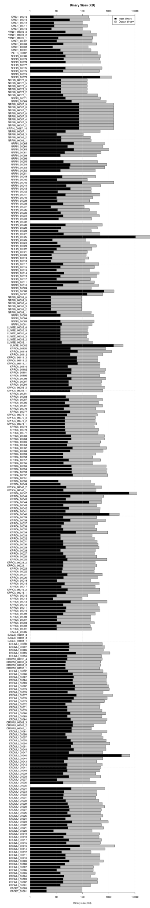

========================================
Translating binaries to LLVM with Revgen
========================================

Revgen is a tool that takes a binary and turns ("lifts") it into LLVM bitcode. It does so in four steps:

* Disassemble the binary using IDA Pro
* Recover the control flow graph (CFG) using `McSema <https://github.com/trailofbits/mcsema>`__
* Translate each basic block in the CFG into a chunk of LLVM bitcode by using QEMU's translator
* Stitch together translated basic blocks into LLVM functions

Revgen relies on QEMU's translator to extract the semantics of machine instructions into a simple intermediate
representation (IR) and S2E's LLVM translator to turn this IR into LLVM bitcode. This brings two main advantages over
competing approaches:

* **Better precision.** QEMU developers spent 15+ years building translators that are precise enough to
  emulate actual operating systems. Even a seemingly simple x86 instruction such as ``call`` needs more than ten pages
  of pseudo code in the Intel instruction set manual. Revgen effortlessly captures the complex behavior of all
  machine instructions, including system instructions not normally used in user programs.

* **Better reliability.** Implementing a translator from scratch brings bugs and incompleteness. Revgen, however,
  can handle pretty much every instruction that QEMU supports, even the most exotic ones.

In the rest of this document, we will show how to use Revgen, how it works under the hood, and give a brief overview of
its performance. As we will see, the main drawback of relying on QEMU's translator is the high overhead of the generated
code (15-30x larger binaries). Revgen would need to reuse various optimization passes in order to bring this
overhead down.

Using Revgen
============

In this section, we show how to use Revgen on DARPA CGC binaries. We cleaned up and made stable our initial `prototype
<http://dslab.epfl.ch/pubs/revgen.pdf>`__ of Revgen in order to analyze CGC binaries, so it supports these binaries the
best. Other types of binaries will be supported in the future.

1. Prerequisites
----------------

Before starting, make sure that you have a functional S2E environment and that you have a working IDA Pro setup. Check
that:

    * IDA can disassemble CGC binaries. You will need to install the CGC plugins, which you can find
      `here <http://idabook.com/cgc/>`__. If you cannot find pre-compiled plugins for your IDA version, you will
      need to compile the plugin yourself using the IDA Pro SDK.

    * IDA has a working Python environment with the ``protobuf`` library installed.
      Running ``pip install protobuf`` should work in most cases.

    * The ``IDA_ROOT`` variable is set to the IDA Pro path, e.g., ``export IDA_ROOT=/opt/ida-6.8``.

Revgen uses `McSema <https://github.com/S2E/s2e/blob/master/tools/tools/scripts/ida/mcsema_get_cfg.py>`__ to recover
the CFG of the binary, and that requires IDA Pro. Note that this is an older version of McSema scripts
(from 2016). `McSema2 <https://github.com/trailofbits/mcsema>`__ has been released in the meantime, which should have
much better CFG recovery. We plan to port Revgen to the latest version.

2. Build the CGC binaries
-------------------------

S2E comes with a Docker image and `instructions <https://github.com/S2E/decree/blob/master/README.md>`__ on how to build
all DARPA CyberGrandChallenge binaries. After you have completed this step, you should have a ``samples`` folder that
contains ~280 binaries:

.. code-block:: bash

    ls -1 $S2E_ENV/source/decree/samples
    CADET_00001
    CADET_00003
    CROMU_00001
    CROMU_00002
    CROMU_00003
    CROMU_00004
    CROMU_00005
    CROMU_00006
    ...

3. Translating a binary
-----------------------

Let us first translate the ``CADET_00001`` binary. For this, set the ``S2E_PREFIX`` and ``IDA_ROOT`` variables,
then run ``revgen.sh``. This tutorial assumes that your S2E environment is in ``$S2E_ENV``.

.. code-block:: bash

    export IDA_ROOT=/opt/ida-6.8
    export S2E_PREFIX=$S2E_ENV/install
    $S2E_PREFIX/bin/revgen.sh $S2E_ENV/source/decree/samples/CADET_00001

You should get the following console output:

.. code-block:: console

    stat: cannot stat '$S2E_ENV/source/decree/samples/CADET_00001.pbcfg': No such file or directory
    [IDA    ] Writing CFG to $S2E_ENV/source/decree/samples/CADET_00001.pbcfg...

    [REVGEN ] Translating $S2E_ENV/source/decree/samples/CADET_00001 to $S2E_ENV/source/decree/samples/CADET_00001.bc...
    warning: Linking two modules of different data layouts: '$S2E_ENV/install/lib/X86BitcodeLibrary.bc' is 'e-m:e-p:32:32-f64:32:64-f80:32-n8:16:32-S128' whereas 'tcg-llvm' is 'e-m:e-i64:64-f80:128-n8:16:32:64-S128'

    [4] RevGen:generateFunctionCall -   >Function 0x804860c does not exist
    [LLVMDIS] Generating LLVM disassembly to $S2E_ENV/source/decree/samples/CADET_00001.ll...
    [CLANG  ] Compiling LLVM bitcode of CGC binary to native binary $S2E_ENV/source/decree/samples/CADET_00001.rev...

You will find the following output files in the ``$S2E_ENV/source/decree/samples`` folder.
The meaning of each file is explained in the ``revgen.sh`` script, but here is an explanation of the most important
ones:

    * ``CADET_00001``: the original binary
    * ``CADET_00001.pbcfg``: the CFG extracted by IDA Pro / McSema
    * ``CADET_00001.bc``: the LLVM bitcode file created by RevGen
    * ``CADET_00001.rev``: the LLVM bitcode file compiled to an ELF binary that you can run on your Linux host

4. Running a translated CGC binary
----------------------------------

Revgen comes with a runtime library that translates Decree system calls to their Linux counterparts. This allows
you to run the translated Decree binaries on your Linux host. For example, running ``CADET_00001`` as follows:

.. code-block:: console

    user@ubuntu:~$ $S2E_ENV/source/decree/samples/CADET_00001.rev

    Welcome to Palindrome Finder

        Please enter a possible palindrome: sdf
                Nope, that's not a palindrome

        Please enter a possible palindrome: aaa
                Yes, that's a palindrome!

        Please enter a possible palindrome:

.. warning::

    Revgen currently supports only CGC binaries. It may or may not be able to generate a bitcode file for other
    kinds of binaries (e.g., Linux or Windows) and cannot run non-CGC binaries.

    Some CGC binaries may fail to translate because of various limitations of the (old) McSema script that Revgen uses.

Design and implementation
=========================

Revgen's design is straightforward: it takes a list of basic blocks, calls a translator to turn them to equivalent
pieces of LLVM bitcode, then stitches these pieces of bitcode together in order to reconstruct original functions.

At a high level, the translator takes a block of machine code (e.g., x86) and turns it into a QEMU-specific intermediate
representation (IR). The translator then transforms this IR to the desired target instruction set (in Revgen's case,
LLVM). The translator is composed of the `CPU emulation library (libcpu)
<https://github.com/S2E/s2e/tree/master/libcpu>`__, which generates the IR, and of the `Tiny Code Generator library
(libtcg) <https://github.com/S2E/s2e/tree/master/libtcg>`__, which handles the IR to LLVM conversion. We extracted
``libcpu`` and ``libtcg`` from QEMU and made both available as standalone libraries. We added LLVM translation
capabilities to ``libtcg``, which you can find `here
<https://github.com/S2E/s2e/tree/master/libtcg/src/tcg-llvm.cpp>`__.

In the rest of this section, we will explain in more details how the translator works and how Revgen uses it to build an
LLVM version of an entire binary. We will also see what it takes to run such binaries and discuss the assumptions that
Revgen makes about them.

Translating basic blocks to LLVM
--------------------------------

Revgen takes the binary file and the CFG recovered my McSema, and turns every basic block in that CFG into a piece of
LLVM code. Revgen stops when it has translated all basic blocks in the CFG. The result is a set of independent LLVM
functions, one for each basic block. Revgen's translator handles basic blocks in two steps: (1) it turns a basic block
into a sequence of micro-operations and then (2) converts them to LLVM instructions. We will see next this process in
more details.

First, the translator  converts machine instructions into an equivalent sequence of micro-operations. For example, the
translator decomposes the x86 instruction ``inc [eax]`` into a load to a temporary register, an increment of that
register, and a memory store. This implements the effects of incrementing the memory location stored in the ``eax``
register. The resulting sequence of micro-operations forms a *translation block*.

Second, the translator maps each micro-operation to LLVM instructions, using a code dictionary. The dictionary
associates each micro-operation with a sequence of LLVM instructions that implement the operation. Most conversions are
one-to-one mappings between micro-operations and LLVM instructions (e.g., arithmetic, shift, load/store
operations).

The translator also handles instructions that manipulate system state. Revgen accurately translates to LLVM
instructions like ``fsave`` or ``mov cr0, eax``. The former saves the state of the floating point unit, while the latter
sets the control register (e.g., to enable 32-bit protected mode, which changes the behavior of many instructions).

For this, the translator uses *emulation helpers*. An emulation helper is a piece of C code that emulates complex
machine instructions that do not have equivalent micro-operations. Revgen compiles emulation helpers to LLVM and adds
them to the code dictionary, transparently enabling the support of machine instructions that manipulate system state.
Helpers are implemented in ``libcpu`` and you can find them `here
<https://github.com/S2E/s2e/tree/master/libcpu/src/target-i386>`__.

Third, the translator packages the sequence of LLVM instructions into an LLVM function that is *equivalent* to the
original basic block taken from the binary.  More precisely, given the same register and memory input, the translated
code produces the same output as what the original binary does if executed on a real processor.

To illustrate this process, let us consider the following function. This function invokes the exit system call
with a status code passed as a parameter on the stack. The function is composed of two basic blocks: one starting
at address ``0x804860C`` and another one at ``0x8048618``.

.. code-block:: asm

    .text:0804860C ; int __cdecl sub_804860C(int status)
    .text:0804860C sub_804860C     proc near
    .text:0804860C
    .text:0804860C
    .text:0804860C status          = dword ptr  4
    .text:0804860C
    .text:0804860C                 mov     eax, 1
    .text:08048611                 push    ebx
    .text:08048612                 mov     ebx, [esp+4+status] ; status
    .text:08048616                 int     80h             ; LINUX - sys_exit
    .text:08048616 sub_804860C     endp
    .text:08048616
    .text:08048618 ; ---------------------------------------------------------------------------
    .text:08048618                 pop     ebx
    .text:08048619                 retn

Revgen turns these two blocks into two LLVM functions that look like this:

.. code-block:: llvm

    define i64 @tcg-llvm-tb-804860c-c-a3-0-4000b7(%struct.CPUX86State* nocapture) local_unnamed_addr #17 {
      %2 = getelementptr %struct.CPUX86State, %struct.CPUX86State* %0, i64 0, i32 5

      ; mov eax, 1
      %3 = getelementptr %struct.CPUX86State, %struct.CPUX86State* %0, i64 0, i32 0, i64 0
      store i32 1, i32* %3, align 4

      ; push ebx
      %4 = getelementptr %struct.CPUX86State, %struct.CPUX86State* %0, i64 0, i32 0, i64 3
      %ebx = load i32, i32* %4, align 4, !s2e.pc !377
      %5 = getelementptr %struct.CPUX86State, %struct.CPUX86State* %0, i64 0, i32 0, i64 4
      %esp = load i32, i32* %5, align 4, !s2e.pc !377
      %6 = add i32 %esp, -4, !s2e.pc !378
      tail call void @__stl_mmu(i32 %6, i32 %ebx, i32 1), !s2e.pc !377

      ; mov ebx, [esp+4+status]
      store i32 %6, i32* %5, align 4
      %7 = add i32 %esp, 4, !s2e.pc !378
      %8 = tail call i32 @__ldl_mmu(i32 %7, i32 1), !s2e.pc !378
      store i32 %8, i32* %4, align 4

      ; int 0x80
      store i32 134514198, i32* %2, align 4
      tail call void @helper_raise_interrupt(i32 128, i32 2)
      ret i64 0
    }

    define i64 @tcg-llvm-tb-8048618-2-99-0-4000b7(%struct.CPUX86State* nocapture) local_unnamed_addr #17 {
      ; pop ebx
      %2 = getelementptr %struct.CPUX86State, %struct.CPUX86State* %0, i64 0, i32 5
      %3 = getelementptr %struct.CPUX86State, %struct.CPUX86State* %0, i64 0, i32 0, i64 4
      %esp = load i32, i32* %3, align 4, !s2e.pc !379
      %4 = tail call i32 @__ldl_mmu(i32 %esp, i32 1), !s2e.pc !379
      %5 = add i32 %esp, 4, !s2e.pc !380
      store i32 %5, i32* %3, align 4

      ; retn
      %6 = getelementptr %struct.CPUX86State, %struct.CPUX86State* %0, i64 0, i32 0, i64 3
      store i32 %4, i32* %6, align 4
      %7 = tail call i32 @__ldl_mmu(i32 %5, i32 1), !s2e.pc !380
      %8 = add i32 %esp, 8, !s2e.pc !380
      store i32 %8, i32* %3, align 4
      store i32 %7, i32* %2, align 4
      ret i64 0
    }

Each function takes a pointer to a ``CPUX86State`` structure. This structure models the CPU's register file. All machine
instructions are translated into LLVM instructions that operate on this CPU state structure.
To handle memory accesses, the translator emits calls to ``__stX_mmu`` and ``__ldX_mmu`` helpers. We will explain later
why the translator generates these instead of native LLVM load/store instructions. The ``int 0x80`` instruction is
complex and the translator calls the ``helper_raise_interrupt`` function to handle it.

Stitching basic blocks into functions
-------------------------------------

Now that Revgen created a set of LLVM functions that represent individual basic blocks of the binary,
it needs to assemble them into a bigger function that represents the original function of the binary.
This is straightforward: Revgen creates a new LLVM function and fills it with calls to the translated basic blocks.
So our example above would look like this:

.. code-block:: llvm

    define i64 @__revgen_sub_804860c_804860c() local_unnamed_addr #0 {
      %1 = getelementptr %struct.CPUX86State, %struct.CPUX86State* @myenv, i64 0
      br label %2

    ; <label>:2:                                      ; preds = %0
      %9 = call i64 @tcg-llvm-tb-804860c-c-a3-0-4000b7(%struct.CPUX86State* %1)
      br label %10

    ; <label>:3:                                     ; preds = %2
      %11 = call i64 @tcg-llvm-tb-8048618-2-99-0-4000b7(%struct.CPUX86State* %1)
      ret i64 %11
    }

``__revgen_sub_804860c_804860c`` is an LLVM function that represents the function called ``sub_804860c``
in the original binary.

Notice how basic blocks are connected together with branch instructions. The example above shows a simple case where
control goes directly from the first basic block to the second (which assumes that the ``int 0x80`` instruction actually
returns).

Handling basic blocks that have several successors is more complex. There can be as few as two successors for simple
direct conditional branches, and many more for switch statements. Luckily for Revgen, IDA Pro and McSema perform the
(very) complex task of computing successors. All Revgen does is read the program counter and call the basic block
associated with it, like this:

.. code-block:: c

    eip = tcg-llvm-tb-abc(env);

    if (eip == 0xabc) {
        tcg-llvm-tb-abc(env);
    } else if (eip == 0xdef) {
        tcg-llvm-tb-def(env);
    } else {
        abort();
    }

The call to ``abort()`` is important to terminate the translated program cleanly in case of unexpected program counters.
This may happen in cases where the binary's CFG was not recovered properly and the program modifies the program counter
to an unexpected value, e.g., in case of self modifying code.

As an exercise, open the ``CADET_00001.ll`` file that Revgen generated and try to find the translated basic blocks and
functions.

Assumptions
-----------

The current implementation of Revgen makes several assumptions about the input binary.

First, the binary is statically linked. Revgen does not currently handle calls to dynamically linked library functions.
An approach to handle calls is to read the emulated stack content and pass its data to LLVM call
instructions, as well as store the return values to the appropriate register (e.g., to ``env->regs[R_EAX]`` for x86
programs). Doing this requires to know the calling convention of the API and to assume that the API is not
sensitive to the aspect of the translated binary (dual stack, different program counters, etc.).

Second, an x86 binary runs in a 32/64-bit protected mode environment with a flat memory model and in user space. This is
important, as the translator may disassemble instructions differently depending on the execution mode. For example,
attempting to translate the x86 ``sysret`` instruction outside protected mode will cause the translator to emit a
general protection fault `exception
<https://github.com/S2E/s2e/tree/master/libcpu/src/target-i386/translate.c#L6934>`__,
aborting the translation process. This behavior is inherited from QEMU's dynamic binary translator. In general, binaries
should come with some sort of section headers describing which execution model they assume so that Revgen can configure
the translator properly.

Third, the input binary may not have self-modifying code. Removing this restriction would certainly be possible given
adequate runtime support, but in that case we would pretty much end up re-implementing QEMU. QEMU handles self-modifying
by detecting writes to code sections and re-translating modified code on the fly.

Running translated binaries
---------------------------

In the previous section, we have seen how Revgen translates machine code to LLVM. We will now see how to run it. This
requires linking the translated bitcode file with a run time that sets up the initial CPU state and provides
emulation helpers that resolve memory accesses and translate system calls.

**Initializing the CPU state.**
The runtime must first initialize the emulated CPU state, in particular the stack pointer register. The translated code
retains all the assumptions of the original binary about the stack layout. In particular, it assumes that local
variables, return addresses, and parameters are located at precise memory addresses when doing stack pointer arithmetic.
The runtime library preserves the original stack layout by using a dual-stack architecture.  There is one *native* stack
used by  the LLVM program and one *implicit* stack, whose pointer is stored in the CPU state structure (e.g.,
``env->regs[R_ESP]`` for x86) and which is manipulated by the translated code. The runtime
allocates the implicit stack and sets the implicit stack pointer before calling the main entry point of the program.

**Resolving pointer arithmetic.**
Revgen embeds a copy of the original binary in the translated binary in order to resolve accesses to its sections at
runtime. Revgen stores each section of the binary in a separate LLVM array. For example, if a program contains a
hard-coded load from address ``0x801234`` that is actually a load from offset ``0x1234`` of the data section, the
runtime will remap the access to the appropriate array. Revgen does not make any sophisticated attempt at lifting global
variables and therefore resorts to this kind of runtime patching.

**Translating system calls.**
For a program to be useful, it has to generally interact with its environment, which is done through system calls.
Depending on the system call flavor (interrupt, syscall, sysenter...), the translator generates a call to a specific
helper function. The runtime needs to implement that helper function so that it can translate the system call of the
original platform to that of the target platform (e.g., `Decree/CGC to vanilla Linux
<https://github.com/S2E/s2e/blob/master/tools/lib/X86RuntimeLibrary/Runtime.cpp#L534>`__). This is very similar to what
user emulation mode in QEMU does.

Evaluation
==========

Revgen produces a translated binary that is about 15-30x bigger than the original. This overhead is high for several
reasons:

1. Revgen does not attempt to perform any sort of optimizations. All it does is a straightforward translation
   of the binary to LLVM using QEMU's translator. It does not attempt to reconstruct variables, simplify
   stack accesses, recover function parameters, lift exceptions, etc.

2. Revgen wraps each memory access into a function call. This makes it simpler to run the translated binary,
   but results in a larger overhead because of the extra call instruction and possible inlining of that call.

3. Revgen embeds the entire original binary in the translated binary. This allows Revgen to correctly translate
   data memory accesses at run time, but doubles the size of the binary.

Ideally, all the above should be done statically during translation. This would make a standalone LLVM binary that can
be linked with the standard library and ran directly on any architecture. This requires much more complex lifting,
similar to what McSema does. An non-exhaustive list of needed tasks would be to lift local and global variables, recover
library function calls, support multi-threading, signals, `exceptions
<https://blog.trailofbits.com/2019/01/21/how-mcsema-handles-c-exceptions/>`__, long jumps, and many more. Proper lifting
would massively cut overhead because it would enable the LLVM toolchain to perform code optimization.
In its current state, the code generated by Revgen cannot be optimized by the compiler.

In the remainder of this section, you will find results for CGC binaries. You can generate the evaluation data using the
`revgen-gen-stats.sh <https://github.com/S2E/s2e/tree/master/tools/tools/scripts/revgen/revgen-gen-stats.sh>`__ script.
It computes the size of various output files as well as the time it takes to generate them. This data is useful to
benchmark Revgen. Here is a sample output of the script:

.. code-block:: console

    BinaryName      InputBinSize    RevgenBinSize   RevgenBcSize    CfgSize IdaTimeMs       RevgenTimeMs    CompileTimeMs
    CADET_00001     4352    93124   370160  10616   1606    3508    5527
    CADET_00003     4352    93124   370160  10616   2292    2348    5463
    CROMU_00001     14616   195040  645784  52420   5275    2929    13887
    CROMU_00002     18756   363416  782796  58706   5716    4138    19192
    ...

You can find the complete data in the ``cgc-binaries.stats`` in the `documentation
<https://github.com/S2E/s2e/tree/master/docs/src/Tutorials/Revgen>`__ repository. The bar chart below shows the size
overhead of binaries produced by Revgen by comparing the original and translated binary size. You can generate the chart
using this `script <https://github.com/S2E/s2e/blob/master/tools/tools/scripts/revgen/revgen-plot-stats.r>`__ (written
in `R <https://www.r-project.org/>`__).

