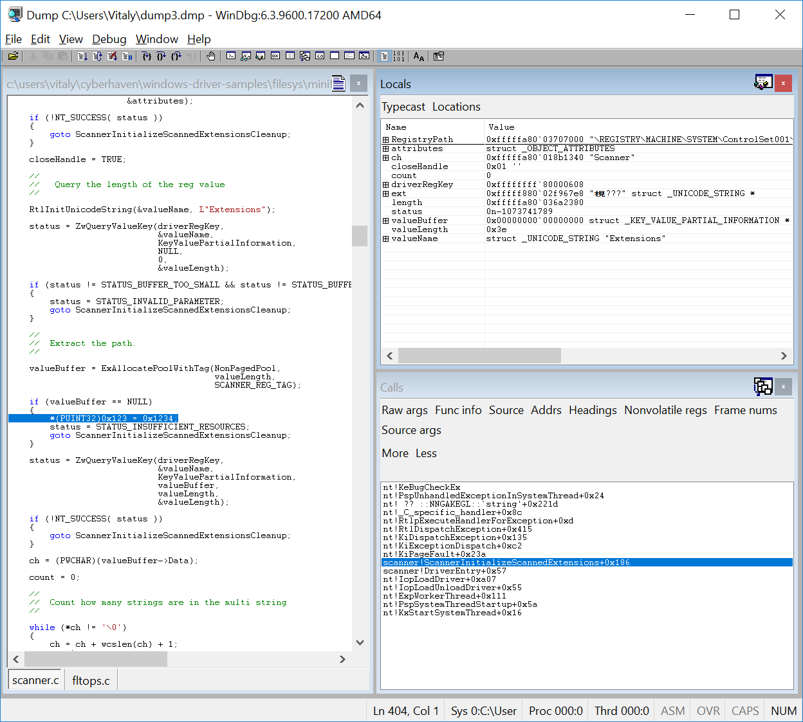

==============================================================================
Testing Error Recovery Code in Windows Drivers with Multi-Path Fault Injection
==============================================================================

Drivers often run in kernel mode, which makes them particularly susceptible to
bringing down the entire system should they contain even the slightest bug.
There are many approaches that attempt to solve or mitigate this problem, such as running drivers
in user space, synthesizing correct-by-construction drivers, using formal verification,
writing them in memory-safe languages, testing, etc.

Drivers (and software in general) often contain error recovery code in order to deal with system errors.
For example, a driver could gracefully shut down if a memory allocation API returns a null pointer.
Sometimes, recovering from the error involves complex steps. In the case of a driver,
this may involve rolling back and deallocating all the internal state. This may be non-trivial,
and unusual error scenarios may trigger untested execution paths, resulting in system crashes.

Error recovery code can be tested using fault injection. A fault injection tool typically
intercepts API calls made by a driver, and instead
of calling the original API, may decide to return an error code that the API call would have made
had it encountered, say, a memory shortage. Whether or not to inject a fault is decided by
a fault scenario. A fault scenario may focus on failing memory allocations, thread creation, various
communication APIs, etc. Fault injection can also go beyond failing APIs, e.g., by corrupting memory with bit flips.
There is a large body of literature that investigates most effective fault scenarios depending on the program under test.

In this tutorial, we will focus on testing error recovery code in Windows drivers using
S2E and symbolic execution. A commonly used tool for fault injection in drivers is Microsoft Driver Verifier.
This tools performs fault injection probabilistically and requires rerunning the driver over and over again
in order to eventually cover all APIs. In contrast, S2E systematically tests every API call, allows
custom fault scenarios, and does not require rerunning the tested driver many times in order to reach full coverage.

After completing this tutorial, you will know:

* How to setup an S2E project to test Windows drivers
* How to get line coverage for Windows drivers
* How symbolic execution can be leveraged for quick and efficient fault injection
* How to add new kernel APIs to the fault injection framework

Before starting, **read the entire tutorial first** in order to get a better overview of the various tasks
and how they connect to each other.

.. contents:: Table of Contents

Setting up S2E
==============

For this tutorial, you will need:

* a Linux environment with S2E installed and running
* a Windows 7 guest image
* a Windows environment to build the driver (see `here <../../WindowsEnvSetup.rst>`__ for details on how to set it up)
* up to 110GB of disk space. The Windows 7 image alone will take 25GB and the Windows 10 build VM up to 60 GB.

Please refer to `Creating analysis projects with s2e-env <../../s2e-env.rst>`__ for more details.

Here is a summary of the commands to run:

.. code-block:: console

    # Initialize the S2E environment
    mkdir -p $(HOME)/s2e
    s2e init $HOME/s2e/env
    cd $HOME/s2e/env

    # Build S2E binaries
    s2e build

    # Create a Windows 7 VM image to run the driver
    # Get the ISO of the required image on MSDN
    s2e image_build --iso-dir /path/to/isos windows-7sp1ent-x86_64

Setting up the Windows Environment
==================================

In order to build Windows drivers, you need the following:

1. A Windows environment (can be a VM)
2. `Microsoft Visual Studio <https://www.visualstudio.com/downloads/>`__ 2015 or 2017
3. `Windows Driver Kit <https://docs.microsoft.com/en-us/windows-hardware/drivers/>`__ (the latest version supported by your Visual Studio version)

Please refer to the Microsoft's documentation on how to set up and build drivers.

You will also need MSYS2 in order to run LCOV for code coverage:

1. Download the MSYS-GIT SDK from `here <https://github.com/git-for-windows/build-extra/releases>`__
2. Launch ``C:\git-sdk-32\msys2.exe`` and type the following commands:

.. code-block:: console

    # Install the environment
    pacman -Syy gcc python2-setuptools
    easy_install-2.7 pip virtualenv

    # Check out the S2E repository. Guest tools are in the guest directory.
    # They contain the s2e.sys guest driver that you will need to use later.
    git clone https://github.com/S2E/s2e.git

    # LCOV will be used to display code coverage
    git clone https://github.com/linux-test-project/lcov

Please refer to the ``guest-tools`` `readme <https://github.com/S2E/s2e/blob/master/guest/windows/README.md>`__
for more details.

Building the Sample Driver
==========================

This tutorial will use the scanner file system filter driver from the Windows Driver Kit samples repository.
You may want to have a look at its source code and readme to see what it does. This is however not required to
complete this tutorial.

In the MSYS environment, run:

.. code-block:: console

    git clone https://github.com/Microsoft/Windows-driver-samples.git

Open the ``filesys/miniFilter/scanner/scanner.sln`` solution in Visual Studio and do the following:

1. Change the driver target version to **Windows 7** and platform to **Desktop**.
Failing to do so will result in a kernel crash if the driver is loaded on Windows 7 or earlier.
The following image shows where to find this setting. Make sure to select
**All Configurations** and **All Platforms** first.

.. image:: drvsettings.png

2. Select **Debug** mode and **x64** architecture. A debug build will give better code coverage information.

.. image:: arch.png

3. Build the driver. You should have the following files:

.. code-block:: console

    scanner.inf
    filter/x64/Debug/scanner.sys
    user/x64/Debug/scanuser.exe

Copy these 3 files into your Linux environment where S2E can find them. It is important that the three files be
in the same folder. You can modify the build settings of the Visual Studio project to put them in the same folder.
You can also use a shared folder to avoid copying them to the VM.

Creating an S2E Driver Project
==============================

In your S2E environment folder, run the following command:

.. code-block:: console

    s2e new_project /path/to/scanner.inf

A successful run looks as follows:

.. code-block:: console

    (venv) user@linux:~/s2e/env$ s2e new_project /mnt/Windows-driver-samples/filesys/miniFilter/scanner/scanner.inf

    INFO: [new_project] Detected Windows INF file, attempting to create device driver project...
    INFO: [infparser] /mnt/Windows-driver-samples/filesys/miniFilter/scanner/scanner.inf
    INFO: [infparser]   class: ContentScreener catalog: scanner.cat
    INFO: [new_project]   Driver files:
    INFO: [new_project]     /mnt/Windows-driver-samples/filesys/miniFilter/scanner/scanner.sys
    INFO: [new_project]     /mnt/Windows-driver-samples/filesys/miniFilter/scanner/scanuser.exe
    WARNING: [new_project] Catalog file /mnt/Windows-driver-samples/filesys/miniFilter/scanner/scanner.cat is missing
    INFO: [new_project] No image was specified (-i option). Attempting to guess a suitable image for a x86_64 binary
    WARNING: [new_project] Found windows-7sp1ent-x86_64, which looks suitable for this binary. Please use -i if you want to use another image
    INFO: [new_project] Creating a symlink to /home/user/s2e/env/install/bin/guest-tools64
    INFO: [new_project] Creating a symlink to /mnt/Windows-driver-samples/filesys/miniFilter/scanner/scanner.inf
    INFO: [new_project] Creating a symlink to /home/user/s2e/env/images/windows-7sp1ent-x86_64/guestfs
    INFO: [new_project] Creating launch script
    INFO: [new_project] Creating S2E configuration
    INFO: [new_project] Creating S2E bootstrap script
    INFO: [new_project] Creating JSON description

This creates a folder ``projects/scanner`` that should contain the following files:

.. code-block:: console

    (venv) user@linux:~/s2e/env$ ls -l projects/scanner/
    total 48
    -rw-rw-r-- 1 user user  5472 Jan 13 22:00 bootstrap.sh
    lrwxrwxrwx 1 user user    58 Jan 13 22:00 guestfs -> /home/user/s2e/env/images/windows-7sp1ent-x86_64/guestfs
    lrwxrwxrwx 1 user user    46 Jan 13 22:00 guest-tools -> /home/user/s2e/env/install/bin/guest-tools64
    -rwxrw-r-- 1 user user  1832 Jan 13 22:00 launch-s2e.sh
    -rw-rw-r-- 1 user user  2898 Jan 13 22:00 library.lua
    -rw-rw-r-- 1 user user   983 Jan 13 22:00 models.lua
    -rw-rw-r-- 1 user user  1659 Jan 13 22:00 project.json
    -rw-rw-r-- 1 user user 10050 Jan 13 22:00 s2e-config.lua
    lrwxrwxrwx 1 user user    90 Jan 13 22:00 scanner.inf -> /mnt/Windows-driver-samples/filesys/miniFilter/scanner/scanner.inf
    lrwxrwxrwx 1 user user    90 Jan 13 22:00 scanner.sys -> /mnt/Windows-driver-samples/filesys/miniFilter/scanner/scanner.sys
    lrwxrwxrwx 1 user user    91 Jan 13 22:00 scanuser.exe -> /mnt/Windows-driver-samples/filesys/miniFilter/scanner/scanuser.exe

You can find mode information about the content of these files and folders in the documentation. To summarize,
``bootstrap.sh`` contains a script that will run in the S2E VM to fetch the driver files, load, and run them.
``s2e-config.lua`` contains the S2E configuration, and ``launch-s2e.sh`` is the script that you will run next to launch
S2E.

Customizing the Driver Project
==============================

The S2E project configurator makes its best effort to guess the type of binaries you want to analyze and create
the appropriate S2E configuration. In this case, it figures out that you want to test a driver. However, it does not
know how to run the driver. For example, although S2E detected that the driver has the ``scanuser.exe`` binary,
it does not know how to launch it in order to exercise the driver.

This section shows how to customize the ``bootstrap.sh`` script in order to properly load and run drivers.
Locate the following code in ``bootstrap.sh``:

.. code-block:: console

    function execute_target {
        # Activate fault injection right before loading the driver
        ./drvctl.exe set_config FaultInjectionActive 1

        # Set this to 1 if you would like more aggressive fault injection, to help harden your driver
        # against arbitrary API call errors. This may add false positives.
        ./drvctl.exe set_config FaultInjectionOverapproximate 1

        # Ask windows to load the driver
        install_driver "$(win_path "$1")"

        # TODO: you may need to manually start the driver using sc
        # sc start my_driver_service

        # TODO: you may want to download additional binaries with s2eget.exe (e.g., a test harness)
        # $S2EGET TestHarness.exe

        # Give some time for the driver to load.
        # You do not need this if your test harness knows when the driver is done loading.
        sleep 30
    }

Modify it as follows:

.. code-block:: console

    function execute_target {
        install_driver "$(win_path "$1")"

        sc start scanner

        # Give some time for the driver to load
        sleep 30
    }

You may also want to have a look at ``scanuser.exe`` to see how it works and invoke it from the ``bootstrap.sh`` script.
This is however not required for this tutorial.

Running the Driver
==================

Once you are done customizing the project, launch S2E:

.. code-block:: console

    (venv) user@linux:~/s2e/env/projects/scanner$ ./launch-s2e.sh

You will see a lot of output in the console. Most of this output is generated by the ``WindowsMonitor`` plugin and shows
various events that occur in the guest, e.g., module loads, process and thread creation, etc. ``WindowsMonitor``
gets this information from the ``s2e.sys`` guest driver, which is part of the ``guest-tools`` repository that you
cloned earlier. We will see later in this tutorial how ``s2e.sys`` works and how you can extend it for your needs.

After about a minute, S2E should terminate. The ``s2e-last`` folder should contain the ``tbcoverage-0.json`` file.
Check that it is not empty, i.e., that it contains at least a few program counters:

.. code-block:: console

    {"scanner.sys": [[5368714608, 5368714650, 48], [5368714656, 5368714665, 11], ... }

We will use this file in order to generate line coverage information for the driver. If you do not see any
program counters in the file, something went wrong. In that case, go to the debugging tips section at the end of this
tutorial.

**Note:** ``s2e-last`` is a symbolic link to the folder that contains the data of the latest analysis run. S2E does not
delete previous runs, so that you can reuse their output if needed. Analysis runs are located in ``s2e-out-xxx`` folders.

Getting Code Coverage Reports
=============================

S2E can generate various types of code coverage. In this section, you will learn how to get line coverage information
when source code is available.

- Build the ``guest-tools/windows/s2e.ln`` solution in Visual Studio in release mode and x64 architecture.
  This solution is located in the ``guest-tools`` repository that you cloned earlier in this tutorial.
  It contains a number of tools to test Windows binaries. If you would like to learn more about it, please refer to
  its `readme <https://github.com/S2E/s2e/blob/master/guest/windows/README.md>`__.

- Extract line information from the driver's PDB file using `pdbparser.exe` as follows:

    .. code-block:: console

        guest-tools/windows/x64/Release/pdbparser.exe -l scanner.sys scanner.pdb > scanner.sys.lines

  The ``scanner.sys.lines`` file contains line information in JSON format. Make sure that this file is in the same folder
  as all the other driver files.

  **Note:** Binaries produced by Microsoft tools contain line information in PDB files. These files have a proprietary
  format and are not readable by Linux tools. We need therefore a Windows tool to extract information from them.

- Run ``s2e coverage lcov scanner``. This should produce the ``scanner.sys.info`` file, which contains
  LCOV coverage info. You should see something like this:

  .. code-block:: console

    (venv) user@linux:~/s2e/env$ s2e coverage lcov scanner
    INFO: [lcov] Generating translation block coverage information
    ERROR: [line_info] Could not read DWARF information from /mnt/Windows-driver-samples/filesys/miniFilter/scanner/scanner.sys: Magic number does not match
    INFO: [jsoninfo] Using /mnt/Windows-driver-samples/filesys/miniFilter/scanner/scanner.sys.lines as source of line information
    INFO: [lcov] Writing line coverage to /home/user/s2e/env/projects/scanner/s2e-last/scanner.sys.info
    INFO: [lcov] Line coverage saved to /home/user/s2e/env/projects/scanner/s2e-last/scanner.sys.info

- If you want to generate LCOV files on windows, proceed as follows. Run the following command in MSYS after
  installing LCOV from `this repository <https://github.com/linux-test-project/lcov>`__:

  .. code-block:: console

    genhtml --ignore-errors source -p "c:/" -p "d:/" -o coverage_report scanner.sys.info

  **Note:** it is important to strip all the drive prefixes (`-p` option) so that ``genhtml`` does not attempt
  to write HTML files all over the file system. The command also ignores sources files that cannot be opened, e.g.,
  those from the standard library, which are typically unavailable.

- You can also generate the LCOV files on Linux using `s2e-env` directly. This however requires that you have
  the source code available on the Linux environment and specify a path to it, like this. Please adapt the path to
  the driver directory accordingly.

  .. code-block:: console

    s2e coverage --sympath /mnt/Windows-driver-samples/filesys/miniFilter/scanner lcov --html scanner

You should see a report like this. Note that the LCOV data generated by S2E does not have function information yet,
so function coverage will be empty.

.. image:: cov1.png

Here are the details for the main driver file:

.. image:: cov2.png

Testing Error Recovery Code
===========================

In the coverage report that you generated previously, you can observe that the error recovery code for
``ZwQueryValueKey`` and ``ExAllocatePoolWithTag`` has not been exercised. In this section, you will learn how
to inject errors in these calls in order to check that the error recovery code behaves properly.

First of all, enable fault injection by setting ``FaultInjectionActive`` to ``1`` in ``bootstrap.sh``:

.. code-block:: console

    function execute_target {
        ./drvctl.exe set_config FaultInjectionActive 1

        install_driver "$(win_path "$1")"

        sc start scanner

        # Give some time for the driver to load
        sleep 30
    }

After you have done so, rerun S2E and re-generate coverage files.

**Tip:** S2E can test multiple fault scenarios in parallel and complete testing quicker. For this, in the ``launch-s2e.sh``
file, set the ``S2E_MAX_PROCESSES`` variable to the number of threads you wish to use and make sure that
``GRAPHICS=-nographics`` variable is set, as S2E does not support graphics output when running in parallel mode.
You will need about 3-3.5GB of RAM per thread, which is about 32GB of memory for 8 threads. The output will be stored in
``s2e-last/xxx/...`` folders, where ``xxx`` is the S2E instance identifier.

You should now see that the error recovery code is exercised:

.. image:: fi_cov1.png

.. image:: fi_cov2.png

Generating Crash Dumps
======================

In this section, we will introduce a bug in the error recovery code and use fault injection in order to find it.

First, insert the following line in the error recovery code at line 404 of ``scanner.c``.

.. code-block:: c

    *(PUINT32*)0x123 = 0x1234;

Then, configure S2E so that it produces crash dumps that can be opened with WinDbg.
S2E does not generate them by default because they can be very large, and depending on how many states crash,
fill up the disk very quickly (a crash dump is as large as the guest physical memory when uncompressed).

To enable crash dumps, open ``s2e-config.lua`` and locate the following section:

.. code-block:: lua

    pluginsConfig.WindowsCrashMonitor = {
        terminateOnCrash = true,

        -- Make this true if you want crashes.
        -- Note that crashes may be very large (100s of MBs)
        generateCrashDump = false,

        -- Limit number of crashes we generate
        maxCrashDumps = 10,

        -- Uncompressed dumps have the same size as guest memory (e.g., 2GB),
        -- you almost always want to compress them.
        compressDumps = true
    }

Set ``generateCrashDump`` to true and rerun the analysis. When the analysis completes, locate the crash dump with the
following command, then copy it to your Windows environment, decompress it, and open it in WinDbg.

.. code-block:: console

    (venv) user@linux:~/s2e/env/projects/scanner$ find s2e-last/ -name *dmp*
    s2e-last/dump3.dmp.gz

Understanding S2E Logs and Test Cases
=====================================

You may have noticed that S2E generated a lot of output in ``debug.txt`` files. In this section, we will explain
the general structure of these logs and focus on the aspects relevant to fault injection.

Using the analysis results of the previous section, grep for BSOD (blue screen of death) in the S2E logs:

.. code-block:: console

    (venv) user@linux:~/s2e/env/projects/scanner$ grep -ri bsod s2e-last/*
    s2e-last/debug.txt:25 [State 0] BaseInstructions: Message from guest (0xfffff88002f961a0): s2e.sys: S2EBSODHook is at FFFFF880028D46C4
    s2e-last/debug.txt:80 [State 3] BaseInstructions: Message from guest (0xfffff88002f95320): s2e.sys: Invoked S2EBSODHook
    s2e-last/debug.txt:80 [State 3] BaseInstructions: Message from guest (0xfffff88002f952e0): s2e.sys: S2EBSODHook: crash dump header of size 0x2000
    s2e-last/debug.txt:80 [State 3] Terminating state early: BSOD: code=0x7e param1=0xffffffffc0000005 param2=0xfffff88002923316 param3=0xfffff88002f965c8 param4=0xfffff88002f95e20

In this example, we see that execution path 3 (aka state 3) has crashed. To see why, open ``s2e-last/debug.txt``
(replace the file name by the one you get for your run).

.. code-block:: console

    80 [State 3] BlueScreenInterceptor: caught blue screen
    80 [State 3] BaseInstructions: Message from guest (0xfffff88002f95320): s2e.sys: Invoked S2EBSODHook
    80 [State 3] BaseInstructions: Message from guest (0xfffff88002f95140): s2e.sys: Backtrace (items: 12)
    80 [State 3] BaseInstructions: Message from guest (0xfffff88002f95140): s2e.sys: FFFFF880028D6DCF s2e.sys:000000013FAD3DCF
    80 [State 3] BaseInstructions: Message from guest (0xfffff88002f95140): s2e.sys: FFFFF880028D4708 s2e.sys:000000013FAD1708
    80 [State 3] BaseInstructions: Message from guest (0xfffff88002f95140): s2e.sys: FFFFF800026D5FC4 ntoskrnl.exe:0000000140074FC4
    80 [State 3] BaseInstructions: Message from guest (0xfffff88002f95140): s2e.sys: FFFFF80002A48614 ntoskrnl.exe:00000001403E7614
    80 [State 3] BaseInstructions: Message from guest (0xfffff88002f95140): s2e.sys: FFFFF80002A03231 ntoskrnl.exe:00000001403A2231
    80 [State 3] BaseInstructions: Message from guest (0xfffff88002f95140): s2e.sys: FFFFF80002701C4C ntoskrnl.exe:00000001400A0C4C
    80 [State 3] BaseInstructions: Message from guest (0xfffff88002f95140): s2e.sys: FFFFF800027016CD ntoskrnl.exe:00000001400A06CD
    80 [State 3] BaseInstructions: Message from guest (0xfffff88002f95140): s2e.sys: FFFFF800027004A5 ntoskrnl.exe:000000014009F4A5
    80 [State 3] BaseInstructions: Message from guest (0xfffff88002f95140): s2e.sys: FFFFF80002711431 ntoskrnl.exe:00000001400B0431
    80 [State 3] BaseInstructions: Message from guest (0xfffff88002f95140): s2e.sys: FFFFF800026D5542 ntoskrnl.exe:0000000140074542
    80 [State 3] BaseInstructions: Message from guest (0xfffff88002f95140): s2e.sys: FFFFF800026D40BA ntoskrnl.exe:00000001400730BA
    80 [State 3] BaseInstructions: Message from guest (0xfffff88002f95140): s2e.sys: FFFFF88002923316 scanner.sys:0000000140007316
    80 [State 3] BaseInstructions: Message from guest (0xfffff88002f952e0): s2e.sys: S2EBSODHook: crash dump header of size 0x2000
    80 [State 3] Terminating state early: BSOD: code=0x7e param1=0xffffffffc0000005 param2=0xfffff88002923316 param3=0xfffff88002f965c8 param4=0xfffff88002f95e20
    80 [State 3] TestCaseGenerator: generating test case at address 0xfffff880028d84ed
    80 [State 3] TestCaseGenerator:
            v0_FaultInjInvokeOrig_FltRegisterFilter__s2e_sys_13fb22717_scanner_sys_14000707e_ntoskrnl_exe_140461c37_140462035_14007ea95_140313b8a_1400668e6_0 = {0xff}; (string) "."
            v1_FaultInjInvokeOrig_ZwOpenKey__s2e_sys_13fb23e9f_scanner_sys_14000720d_14000708e_ntoskrnl_exe_140461c37_140462035_14007ea95_140313b8a_1400668e6_1 = {0xff}; (string) "."
            v2_FaultInjInvokeOrig_ZwQueryValueKey__s2e_sys_13fb23efa_scanner_sys_14000724e_14000708e_ntoskrnl_exe_140461c37_140462035_14007ea95_140313b8a_1400668e6_2 = {0xff}; (string) "."
            v3_FaultInjInvokeOrig_ExAllocatePoolWithTag__s2e_sys_13fb2195e_scanner_sys_14000727b_14000708e_ntoskrnl_exe_140461c37_140462035_14007ea95_140313b8a_1400668e6_3 = {0x0}; (string) "."

Each line of the S2E debug log is composed of several fields:

1. The first column is the elapsed time in seconds since S2E started (here 80 seconds)

2. The second column indicates which execution path generated the log, and if applicable, on which S2E instance
   (when running S2E in parallel mode).

3. The third column indicates which plugin output the message. In this case, the ``BlueScreenDetector`` plugin
   caught the crash, then called ``s2e.sys`` in the guest to display the backtrace. ``s2e.sys`` used a special
   x86 instruction to call the S2E plugin ``BaseInstructions`` in order to print the backtrace.

4. Finally, the blue screen interceptor terminated the execution path (*terminated state early* message)
   causing the test case generator to output the concrete test case.

The logs above display two important pieces of information: the backtrace of the bug check and the sequence of faults
that led to the error. In this example, the crash occurred in ``scanner.sys`` at address ``0x140007316``.
The sequence of API calls that led to this bug is ``FltRegisterFilter``, ``ZwOpenKey``, ``ZwQueryValueKey``, and ``ExAllocatePoolWithTag``.
S2E injected a fault only on the last invocation. Note that S2E only supports a subset of kernel APIs, the driver
might have called other APIs that do not appear here.

Let us now explain in more detail how S2E encodes test cases:

.. code-block:: console

    v0_FaultInjInvokeOrig_FltRegisterFilter__s2e_sys_13fb22717_scanner_sys_14000707e_ntoskrnl_exe_140461c37_140462035_14007ea95_140313b8a_1400668e6_0 = {0xff}; (string) "."
    v1_FaultInjInvokeOrig_ZwOpenKey__s2e_sys_13fb23e9f_scanner_sys_14000720d_14000708e_ntoskrnl_exe_140461c37_140462035_14007ea95_140313b8a_1400668e6_1 = {0xff}; (string) "."
    v2_FaultInjInvokeOrig_ZwQueryValueKey__s2e_sys_13fb23efa_scanner_sys_14000724e_14000708e_ntoskrnl_exe_140461c37_140462035_14007ea95_140313b8a_1400668e6_2 = {0xff}; (string) "."
    v3_FaultInjInvokeOrig_ExAllocatePoolWithTag__s2e_sys_13fb2195e_scanner_sys_14000727b_14000708e_ntoskrnl_exe_140461c37_140462035_14007ea95_140313b8a_1400668e6_3 = {0x0}; (string) "."

What you see above is a concrete test case of the crash. A concrete test case consists of an assignment of concrete
values to symbolic variables. The variable names are on the left hand side and the concrete values are on the right
hand side, encoded as C arrays of bytes. In this example, each variable is one byte in size. A non-zero value means
that S2E did not inject a fault (i.e., it invoked the original function, hence ``"InvokeOrig" == true``). A value of 0 means
that S2E skipped the function call and returned a fault instead (hence ``"InvokeOrig" == false``).

So where do these symbolic variables come from? In order to understand this, consider the following pseudo-code example.
This represents a typical pattern of intercepting API calls and injecting faults. It is implemented
in the ``s2e.sys`` driver.

.. code-block:: c

    VOID S2EHook_ExAllocatePoolWithTag(...) {
        STRING VarName = CreateVariableName(...); // FaultInjInvokeOrig_scanner_sys_...
        CHAR C = CreateSymbolicValue(VarName);
        if (C) {
            return ExAllocatePoolWithTag(...);
        } else {
            return NULL;
        }
    }

First, the driver asks S2E to create a variable name that encodes useful information
(e.g., the name of the called API and the address of the call site). Second, it asks S2E to create a symbolic value
with that name. When execution reaches the if statement, S2E sees that it depends on a symbolic variable, determines that
both branches are feasible, and splits the execution path in two. In the first path, the original API is called,
and in the second, the API is skipped and replaced by an error code (here a null pointer). S2E implements path splitting by forking the
entire state of the virtual machine. Each forked state is completely independent from the other states and
can run on its own. This forking process is recursive: when ``s2e.sys``
encounters the next API call, it forks again, eventually forming an execution tree of all possible API failures.

When an execution path terminates (i.e., ``bootstrap.sh`` calls ``s2ecmd.exe kill``), S2E invokes a constraint solver
(currently `Z3 <https://github.com/Z3Prover/z3>`__), in order to compute concrete assignments to symbolic variable.

Let us know look at all the components of a symbolic variable name. They will be very useful to locate the source of
the bug. They have five components:

.. code-block:: console

    1. v0
    2. FaultInjInvokeOrig
    3. FltRegisterFilter
    4. s2e_sys_13fb22717_scanner_sys_14000707e_ntoskrnl_exe_140461c37_140462035_14007ea95_140313b8a_1400668e6
    5. 0

1. This is the constraint identifier, a number relative to the current state. This allows
   to easily figure out the order in which the faults have been injected.

2. The fault injection library identifier. This string indicates that the variable was created by the fault injection
   library when deciding whether or not to inject a fault. This is useful to distinguish fault injector variables
   from other kinds of variables introduced by other components.

3. The API function that was intercepted by the fault injection system.

4. The callstack at the location of fault. This is in practice the most useful information. When you get a crash,
   look at all variables set to 0 (i.e., fault has been injected), and you will immediately know the location of the fault
   in your code. The callstack encoding omits the module name for consecutive addresses that belong to the same module.
   This helps keep the variable names shorter. In the example above, the callstack is the following:

    .. code-block:: console

      s2e.sys:      13fb22717
      scanner.sys:  14000707e
      ntoskrnl.exe: 140461c37
      ntoskrnl.sys: 140462035
      ntoskrnl.sys: 14007ea95
      ntoskrnl.sys: 140313b8a
      ntoskrnl.sys: 1400668e6

   You may pretty-print the addresses using ``pdbparser.exe`` from the ``guest-tools`` repository. Please refer
   to the ``guest-tools`` `readme <https://github.com/S2E/s2e/blob/master/guest/windows/README.md>`__ for more details
   about how to use ``pdbparser.exe``.

5. Global variable identifier. This integer suffix ensures that the variable name is globally unique.
   Also, note that S2E replaces any special characters in the variable name
   by underscores, in order to make sure that the names are valid for the solver.

Customizing Fault Injection
===========================

In the previous sections, you have learnt how to use S2E to test error recovery code. In this section, we will show
how you can extend S2E's fault injection capabilities, e.g., by adding support for new APIs.

This process is very simple:

1. Look at the code coverage and locate API calls that were not exercised
2. For each API call, determine its error codes and pick one for injection (typically ``STATUS_INSUFFICIENT_RESOURCES``
   will do).
3. Create and register a hook function that will intercept the original call and inject the fault.
   Just copy/paste existing examples in ``guest-tools/windows/driver/src/faultinj``.
4. Rebuild the driver and place it in the ``guest-tools`` folder of your S2E project.

**Note:**

* In general, a concrete error code is sufficient. You may also want to create a symbolic value instead, constrained
  to the set of errors that the original API might return.

Debugging Tips
==============

* Make sure that you have the latest ``s2e.sys`` binary. We provide a binary version of this file on GitHub, which should
  be fetched by the S2E build system. This file may sometimes be outdated. In case of doubt, rebuild the ``s2e.sln``
  solution, then run ``makedist.bat``, and copy the driver files in ``guest-tools/windows/dist`` to the ``guest-tools``
  directory of your project.
  Refer to this `readme <https://github.com/S2E/s2e/blob/master/guest/windows/README.md>`__ for more information about
  how to build ``s2e.sys``.

* If you do not see any output at all and execution terminates in a few seconds, check that ``s2e.sys`` got loaded
  properly. If you see output form ``s2e.sys`` but the coverage file is empty, check that the tested driver loaded properly.
  The ``serial.txt`` file contains the console output. If ``sc.exe`` fails for whatever reason, you will see why.
  If you see something like *This driver has been blocked from loading*, make sure you did not copy the 32-bit build
  by mistake (or the 64-bit build if you use a 32-bit guest).

* If the console shows something that looks like a kernel crash and a backtrace of the driver very early on,
  check that you changed the target platform to Windows 7. Running a driver compiled for Windows 8 and later will crash
  on Windows 7 because that OS does not support stack cookies.

* Enable graphics output in ``launch-s2e.sh``. This way, you will see the guest's GUI and will be able to run
  additional Windows tools (e.g., looking at the event viewer). The VM contains the Sysinternals tools in
  ``c:\sysinternals`` which may help with debugging.

* Coverage information is by default written when an execution path terminates. It may not be written if you terminate S2E by
  killing it or closing its window. If the path seems to have run for a long time, open a terminal in the guest
  and run ``c:\s2e\s2ecmd.exe kill 0 0``. Alternatively, you can use the ``writeCoveragePeriod`` option of the
  ``TranslationBlockCoverage`` plugin in order to periodically dump coverage of the currently running state.

* It may happen that the coverage report shows that some error recovery code is not exercised from one run to the next.
  S2E does not seem to terminate properly, some ``debug.txt`` logs are truncated. This is most likely due to an
  out-of-memory error. Make sure you have enough memory to run S2E, especially if you run in parallel mode.
  You may also need to run ``sudo sysctl -w vm.max_map_count=655350`` in order to increase the number of permitted memory
  allocations.
