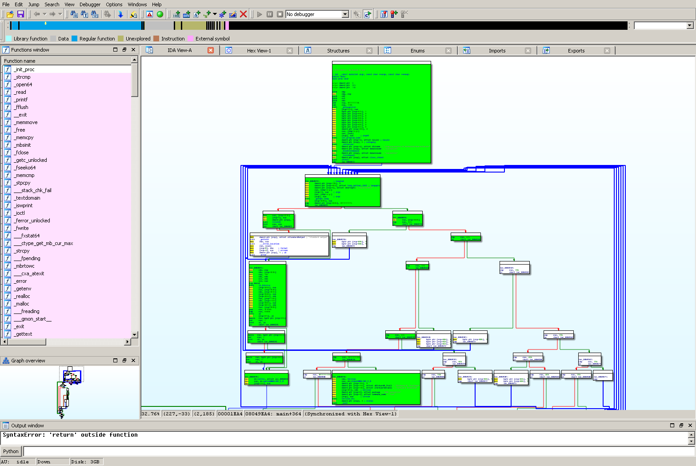

==========================
Coreutils Coverage Testing
==========================

The `GNU Core Utilities <https://www.gnu.org/software/coreutils/coreutils.html>`_ are the basic file, shell and text
manipulation utilities of the GNU operating system. This demo walks you through the process of using S2E to analyze the
``cat`` program and generate basic block and line coverage information.

.. contents::

Preparing the target binary
===========================

The first step is to build the coreutils package. In this tutorial, we will use version `8.26
<https://ftp.gnu.org/gnu/coreutils/coreutils-8.26.tar.xz>`_ . We will build a 32-bit version of Coreutils with debug
symbols (so that we can generate line coverage).

.. code-block:: console

    wget https://ftp.gnu.org/gnu/coreutils/coreutils-8.26.tar.xz
    tar xf coreutils-8.26.tar.xz

    cd coreutils-8.26
    mkdir build
    cd build
    ../configure CFLAGS="-g -m32" --prefix=$(pwd)
    make
    make install

The coreutils programs will be available in ``coreutils-8.26/build/bin``.

Setting up the test environment
===============================

Use ``s2e-env`` to create your S2E environment. Follow `these <../s2e-env.rst>`_ instructions to build a 32-bit Linux
image (from ``linux-4.9.3-i386``). Once you have an image you can create your project.

.. code-block:: console

    s2e new_project --image debian-8.7.1-i386 /path/to/coreutils-8.26/build/bin/cat @@

The ``@@`` symbol tells ``s2e-env`` to generate a bootstrap file that will run ``cat`` with a symbolic file as input.
By default this symbolic file will be a 256 byte file filled with ``null`` bytes.

For testing ``cat`` we will have to modify this symbolic file slightly. Instead of having the symbolic file filled with
``null`` bytes, we will add some actual text to the file to make it more representative of using ``cat``. Open
``bootstrap.sh`` and replace ``truncate -s 256 ${SYMB_FILE}`` with:

.. code-block:: bash

    echo "Here is some text" > ${SYMB_FILE}

The ``TranslationBlockCoverage`` plugin is required for generating coverage information. This plugin is enabled by
default in ``s2e-config.lua``. A translation block is a sequence of instructions ending with a change of control flow.
In comparison, a basic block is a translation block with the added restriction that no code outside of the basic block
can jump into the middle of it. At runtime, QEMU splits guest code into translation blocks and further translates
these blocks into host instructions so that they can be executed. S2E intercepts and logs this translation process.
These logs are saved as JSON files when the ``writeCoverageOnStateKill`` option is enabled (also enabled by default).
These JSON files will be used to produce the basic block and line coverage summary.

You can then run S2E with the ``launch-s2e.sh`` script. You may wish to leverage multi-process mode by setting
``S2E_MAX_PROCESSES=XX`` in ``launch-s2e.sh``. Let S2E run for approximately five minutes before stopping it (e.g. via
``killall -9 qemu-system-i386``).

Generate line coverage
======================

``s2e-env`` also provides a subcommand to summarize line coverage information. Generating line coverage information
requires that the target program be compiled with debug symbols and that the source code is available. Line coverage
information is generated in the `lcov <http://ltp.sourceforge.net/coverage/lcov.php>`_ format.

To generate the lcov file, run:

.. code-block:: console

    s2e coverage lcov --html cat

This will generate the following in ``projects/cat/s2e-last``:

* A ``coverage.info`` file containing the line coverage information in lcov format
* A HTML report in the ``lcov`` directory

Note that the ``lcov`` format also allows for function and branch coverage information to be recorded - however this
is not yet available. The image below shows a snippet from the generated HTML report.

.. image:: ../img/lcov_example.png

Generate basic block coverage
=============================

``s2e-env`` provides a subcommand that can summarize basic block coverage. Note that this currently requires IDA Pro to
parse the target binary and extract the basic blocks from it. You must specify the path to IDA Pro in your ``s2e-env``
config file (see `here <https://github.com/S2E/s2e-env/blob/master/README.md>`_ for details). In order to produce this
basic block listing you can run the following:

.. code-block:: console

    s2e coverage basic_block cat

The basic block coverage subcommand will perform a block coverage analysis on ``s2e-last`` in the ``cat`` project by
mapping translation block coverage generated by the ``TranslationBlockCoverage`` plugin to the basic block information
extracted by IDA Pro. The result will be written to ``projects/cat/s2e-last/basic_block_coverage.json``, part of which
is shown below.

.. code-block:: json

    [
        {
            "end_addr": 134521719,
            "function": "main",
            "start_addr": 134521716
        },
        {
            "end_addr": 134520335,
            "function": "main",
            "start_addr": 134520309
        },
        {
            "end_addr": 134534133,
            "function": "atexit",
            "start_addr": 134534128
        },
        {
            "end_addr": 134522543,
            "function": "set_program_name",
            "start_addr": 134522536
        },
        {
            "end_addr": 134522670,
            "function": "set_program_name",
            "start_addr": 134522653
        },
        {
            "end_addr": 134528828,
            "function": "safe_write",
            "start_addr": 134528823
        }
    ]

The user can then use this data however they require. For example, the S2E `tools <https://github.com/S2E/tools>`_ repo
contains an IDA Pro script to highlight the basic blocks covered by S2E during analysis. This script can be found at
``install/bin/highlight_basic_blocks.py`` in your S2E environment. To run the script, open the ``cat`` binary in IDA
Pro, select "Script file" from the "File" menu and open ``install/bin/highlight_basic_blocks.py``. You will be prompted
for the ``basic_block_coverage.json`` file generated by S2E. Select this file and the basic blocks executed by S2E will
be colored green. Depending on how long you let S2E run for and how many translation blocks it executed, you should get
a graph similar to the following:

